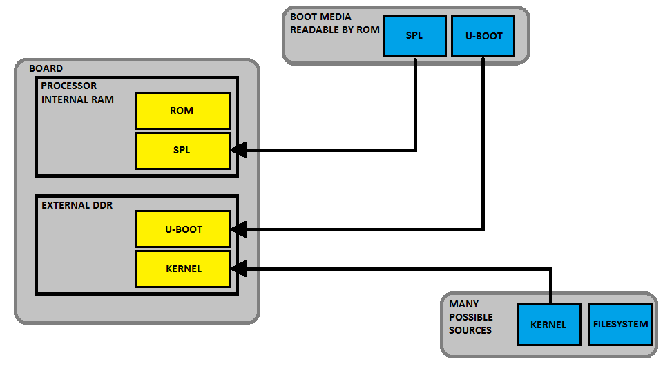

# A40i Boot Sequence
=====

## Determining boot source
- bootloader에서는 주소 0x28 의 데이터에 따라 부트 디바이스를 select한다. 
[http://linux-sunxi.org/Boot_Process]

## BROM
-----
- Primary Program Loader
- ROM code는 사전 프로그래밍 된 여러 위치 중 하나에서 SRAM으로 작은 부트코드를 로드.
- 예) NAND Flash, SPI (Serial Peripheral Interface)를 통해 연결된 플래시 메모리, MMC 장치 첫 번째 섹터(SD카드)등에서 SPL 을 읽는다.
- Allwinner사 SoC는 Specific boot process를 가지고 있다.
- SoC는 BROM이 있는 주소  0xffff0000에서 명령어를 가져오기 시작한다.(처음 a tiny on chip rom이라고 불리는 BROM이 실행된다.) 
- BROM은 두 부분으로 나뉘며, 첫번째 부분은 [0xffff0000](https://github.com/lchy0113/Allwinner-Info/blob/master/BROM/ffff0000.s) 은 FEL모드이고, 두번째 부분은 eGON.BRM([0xffff4000](https://github.com/lchy0113/Allwinner-Info/blob/master/BROM/ffff4000.s))이다.

- Reset vector 
 Reset vector는 FEL 모드의 맨 처음 주소 0xffff0000에 위치하며, reset시 0xffff0028로 점프하여 0xffff4000 (eGON.Boot ROM)을 프로그램 카운터에 로드하여 jump한다.

- eGON BOOT
 SDC0, SPI0, eMMC2, SDC2, NAND Flash 및 USB 에서 연속적으로 부팅을 시도하며 동시에 외부 핀  Boot Select Pin 이 Low 상태가 되면 USB Mode 로 부팅을 시도한다. 

# The eGON Boot ROM performs a few tasks:  
 	1. does some [co-processor setup](https://github.com/lchy0113/Allwinner-Info/blob/4777ddf2a26eca973484714ac48bbaf18849dab4/BROM/ffff4000.s#L19)  
	2. Disables the [WatchDog Timer](https://github.com/lchy0113/Allwinner-Info/blob/4777ddf2a26eca973484714ac48bbaf18849dab4/BROM/ffff4000.s#L23)	  
	3. Setups [CPU, AXI, AHB, and APB0 clocks](https://github.com/lchy0113/Allwinner-Info/blob/4777ddf2a26eca973484714ac48bbaf18849dab4/BROM/ffff4000.s#L28)  
	4. [Enables AHB Gating](https://github.com/lchy0113/Allwinner-Info/blob/4777ddf2a26eca973484714ac48bbaf18849dab4/BROM/ffff4000.s#L34)  
	5. [Enables APB0 Gating](https://github.com/lchy0113/Allwinner-Info/blob/4777ddf2a26eca973484714ac48bbaf18849dab4/BROM/ffff4000.s#L38)  
	6. [Sets the Stack Pointer to 32K](https://github.com/lchy0113/Allwinner-Info/blob/4777ddf2a26eca973484714ac48bbaf18849dab4/BROM/ffff4000.s#L40)  
	7. then it [jumps](https://github.com/lchy0113/Allwinner-Info/blob/4777ddf2a26eca973484714ac48bbaf18849dab4/BROM/ffff4000.s#L41) to [boot](https://github.com/lchy0113/Allwinner-Info/blob/4777ddf2a26eca973484714ac48bbaf18849dab4/BROM/ffff4000.s#L84) which immedidately [jumps to](https://github.com/lchy0113/Allwinner-Info/blob/4777ddf2a26eca973484714ac48bbaf18849dab4/BROM/ffff4000.s#L86) [check_uboot](https://github.com/lchy0113/Allwinner-Info/blob/4777ddf2a26eca973484714ac48bbaf18849dab4/BROM/ffff4000.s#L2551).  
	8. [check_uboot](https://github.com/lchy0113/Allwinner-Info/blob/4777ddf2a26eca973484714ac48bbaf18849dab4/BROM/ffff4000.s#L2551) setups up some registers, then [checks the status pin](https://github.com/lchy0113/Allwinner-Info/blob/4777ddf2a26eca973484714ac48bbaf18849dab4/BROM/ffff4000.s#L2560)(often called FEL pin, BSP pin or uboot)  
		8.1 If the pin is low (connected to GND) [executes](https://github.com/lchy0113/Allwinner-Info/blob/4777ddf2a26eca973484714ac48bbaf18849dab4/BROM/ffff4000.s#L90) [FEL](https://linux-sunxi.org/FEL) mode at 0xffff0020.   
		8.2 If the pin is high it continues trying to boot from the following media and on failure continues to the next in order.   
			8.2.1 [SD Card0](https://github.com/lchy0113/Allwinner-Info/blob/4777ddf2a26eca973484714ac48bbaf18849dab4/BROM/ffff4000.s#L91) also known as MMC0  
			8.2.2 [Internal Nand Flash](https://github.com/lchy0113/Allwinner-Info/blob/4777ddf2a26eca973484714ac48bbaf18849dab4/BROM/ffff4000.s#L98) also known as NAND  
			8.2.3 [SD_Card2](https://github.com/lchy0113/Allwinner-Info/blob/4777ddf2a26eca973484714ac48bbaf18849dab4/BROM/ffff4000.s#L104) also known as MMC2  
			8.2.4 [SPI connected NOR flash](https://github.com/lchy0113/Allwinner-Info/blob/4777ddf2a26eca973484714ac48bbaf18849dab4/BROM/ffff4000.s#L111) alsk known as SPI  
			8.2.5 [If all fails](https://github.com/lchy0113/Allwinner-Info/blob/4777ddf2a26eca973484714ac48bbaf18849dab4/BROM/ffff4000.s#L117), FEL/USB Boot mode is [executed](https://github.com/lchy0113/Allwinner-Info/blob/4777ddf2a26eca973484714ac48bbaf18849dab4/BROM/ffff4000.s#L120) from 0xffff0020  
  
```
boot-> check fel key pressed (yes) --> FEL mode (boot from USB OTG0
				\
				(no) \
					\----->	1) try to boot from SDC0.
						2) try to boot from SPI0.
						3) try to boot from eMMC2.
						4) try to boot from SDC2.
						5) try to boot from NAND.
						6) FEL mode (boot form USB OTG.
```


* BROM은 부팅 모드를 확인 한다.(SDCARD > NAND) 각 장치의 u-boot SPL 로드를 시도한다.
(ROM)-> (SPL) -> (u-boot) -> (kernel)

## SPL(Secondary Program Loader)
-----
- 일반적으로 SRAM이 u-boot와 같은 전체 부트로더를 로드하기에 충분히 크지 않기 때문에 보조 프로그램 로더(SPL)가 있어야 한다.
- SPL은 TPL을 주 메모리(DRAM)에 로드하도록 메모리 컨트롤러 및 시스템의 기타 필수 부분의 초기화를 수행한다
- 그 다음 플래시 장치의 시작 부분에서 사전 프로그래밍 된 오프셋 또는 u-boot.bin등과 같은 알려진 파일 이름을 사용하여 ROM코드와 마찬가지로
- 저장 장치 목록에서 프로그램을 주 메모리에 올린다.

## u-boot
-----
- U-Boot 또는 Barebox와 같은 전체 부트 로더는 간단한 명령 줄 사용자 인터페이스, 커널 이미지를 네트웍 또는 플래시 저장소에서 로드 및 부팅과 같은 유지 관리 작업을 수행.
- 커널이 실행되면 부트로더는 일반적으로 메모리에서 사라지고 시스템 작동에 더 이상 참여하지 않는다.

## kernel
-----
- 커널이 실행되고 시스템의 제어권을 갖는다. 



- ROM 및 SPL 부트로더는 내부 RAM을 사용하여 실행하는 반면,  u-boot 및 커널은 DDR에서 실행된다.
