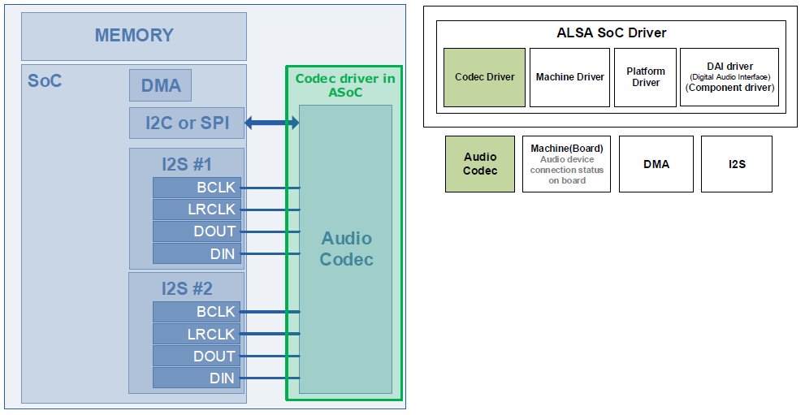
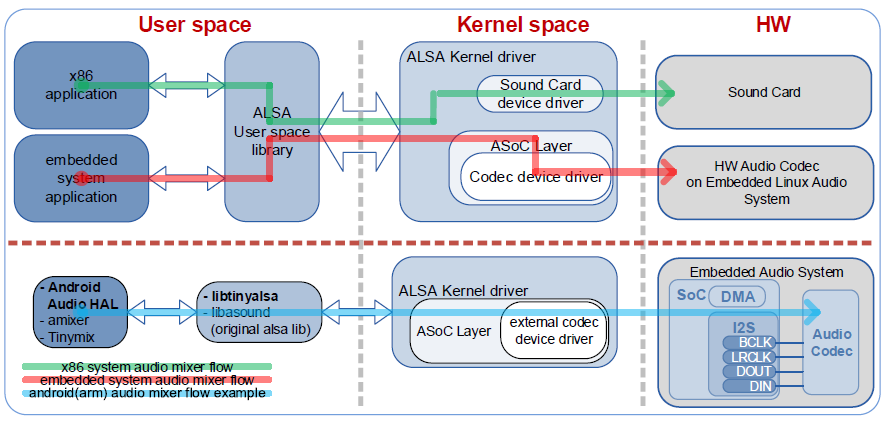

# ALSA

<hr/>

## Introduce ALSA
 - user 영역과 kernel 영역이 나누어져 있고, user영역에서는 ALSA library를 호출하여 사용합니다.
  

 - ALSA Kernel Driver
   * ALSA Kernel Driver는 User space의 System call(open, ioctl, write, read, close)에 대응
   * ALSA Kernel Driver는 User space의 Sound Card Device Drier의 인터페이스를 담당하고 Audio Buffer 및 Signal을 관리 및 운용
  

  - ALSA Library
   * Application에게 공통된 API를 제공하여 ALSA Kernel Driver를 사용 할 수 있도록 합니다.
   * ALSA Library가 /dev/snd/* 경로의 device file을 제어함으로써 Application에서 직접 device file을 제어할 필요가 없습니다.
  


<hr/>

## ALSA directory Architecture

```bash
/kernel/sound$ tree -L 1 -d
.
├── aoa
├── arm
├── atmel
├── core
├── drivers
├── firewire
├── i2c
├── isa
├── mips
├── oss
├── parisc
├── pci
├── pcmcia
├── ppc
├── sh
├── soc
├── sparc
├── spi
├── synth
└── usb

20 directories
```
 1) arm, ppc, sparc 
 	: 각 아키텍처에 specific 한 top-level card 모듈
 2) core  
 	- core/oss : pcm 과 mixer oss 에뮬레이션 코드가 저장되어 있음.
	- core/seq : ALSA sequencer를 위한 서브 디렉토리. sequencer core & primary sequencer 모듈. CONFIG_SND_SEQUENCER가 kernel config에 설정되어 있을때만 컴파일 됨.
	- core/seq/oss : OSS sequencer 에뮬레이션 코드
 3) include 
 	: ALSA 드라이버의 공용 헤더파일들을 위한 디렉토리
 4) drivers 
 	: 서로 다른 아키텍쳐상의 서로 다른 드라이버들 중 공유 코드. ex) pcm driver, serial midi driver
 5) i2c
 	: alsa i2c 컴포넌트 포함.
	: linux상의 표준 i2c가 존재하지만 ALSA는 sound 카드를 위한 전용 i2c를 사용.
 6) oss
 	: oss/lite는 linux 2.6 tree에 여기에 저장됨.
 7) pci
 	: pci 사운드 카드를 사용한 top-level card module과 pci 버스에 특화된 코드.
 8) pcmcia
 	: pcmcia, 특히 pccard 드라이버는 이 디렉토리에 위치함.
 9) synth 
 	: the synth 미드레벨 모듈 포함하고 있음.
 10) soc
 	: embedded system을 위한 driver
 11) usb 
 	: usb-audio driver를 포함.

<hr/>

## ASoC 는 기본적으로 4가지의 driver로 구성됩니다.

 - codec driver : Audio Codec 내 Control을 제어한다.   
	: DAC 또는 AMP를 device에 붙이게 된다면 vendor사에서 기본적으로 제공하는 driver입니다. 또한 sound/soc/codecs directory에도 있으니 참조하면 됩니다.  
	: 말 그대로 codec의 특성 및 운영 방법에 대한 명세입니다. (regmap을 사용합니다.)  
	: Codec DAI 를 설정합니다.  
	: mixer와 오디오를 컨트롤합니다.(Documentation/sound/alsa/soc/codec.txt 73Line)   
	: ex) sound/soc/codecs/ak7755.c  
	

 - platform driver : SoC 내 DMA 및 DAI를 제어  
	: stream 제어와 관련된 사항들을 설정하는 부분입니다. raw data, pcm이나 compress data(mp3등)을 출력하기 위해서는 buffer를 control해주어야 하는데, 이와 관련된 부분이 platform driver입니다.  
	: platform driver 는 audio DMA drivers, SoC DAI drivers, DSP drivers 로 나눌수 있습니다. (Documentation/sound/alsa/soc/platform.txt)  
	  

 - machine driver : embedded board의 audio 관련 device의 연결상태를 선언 및 제어합니다.(sound card등록)  
	: sound card를 등록하고 dai(digital audio interface)-i2s 및 codec device 관계를 설정.  
	: 즉, ASoC machine driver는 모든 구성 요소 driver(e.g. codecs driver, platform driver, component driver)를 하나로 묶는 코드입니다.  
	: 기존에 machine driver를 참고하여 개발하거나 기존 reference code를 참고하여 개발하면 됨.  
	: ex) sound/soc/tcc/tcc_board_ak7755.c  
	  

 - component driver : i2s ip block 및 audio codec내 audio interface(i2s, pcm, pdm 등)을 제어합니다.  
	: i2s ip block 및 audio codec 내 audio interface 관계와 관련있습니다.   
	: machine driver에서 dai의 detail이 더해졌다고 생각하면 됩니다.  
	  


> A. ALSA 는 X86의 Sound Card를 위해 만들어 졌습니다.
> B. Embedded processor 용에 대응하기 위하여 ALSA System On Chip(SoC) Layer가 존재.
> C. ASoC는 다음 목표로 설계 되었다.
>
>    1) Audio Codec Driver 독립적 및 재사용 가능 하도록 설계
>    2) Audio Codec 과 I2S 및 PCM Audio interfac의 연결을 쉽도록 설계
>    3) Dynamic Audio Power Management(DAPM) 설계 (Audio Codec 내 Power Block 자동 제어 알고리즘)
>    4) Pop 및 Click 잡음 감소 (Audio Codec의 Power를 up/down 하면서 생겨나는 잡음을 줄임)
>    5) Board 특정 컨트롤을 위해 설계. 예를들면 스피커 앰프를 위한 소리 제어
>       (ASoC의 도움 없다면 Audio Function과 별개로 GPIO 제어로 스피커 앰프를 ON/OFF 시켜야 한다)
>
<hr/>

## ALSA Operation Diagram
 - 초록색 Diagram은 PC에서 sound를 출력하는 형태.
 - 붉은색 Diagram은 embedded system에서 sound를 출력하는 형태.
 - 파란색 Diagram은 Android platform에서 sound를 출력하는 형태.
	 

<hr/>

# ALSA audio system

## 1. Overview
 사용 버전 : 
 - kernel : 3.18.24
 - SoC : Telechips series
 - CODEC : cx20703, ak7755
 - userspace : tinyalsa
	
 Linux ALSA audio system Architecture 는 아래와 같습니다. 

```bash
            +--------+  +--------+  +--------+
            |tinyplay|  |tinycap |  |tinymix |
            +--------+  +--------+  +--------+
                 |           ^           ^
                 V           |           V
            +--------------------------------+
            |        ALSA Library API        |
            |      (tinyalsa, alsa-lib)      |
            +--------------------------------+
user space                   ^
-----------------------------|--------------------
kernel space 
            +--------------------------------+
            |             ALSA CORE          |
            | +-------+ +-------+ +-----+    |
            | |  PCM  | |CONTROL| | MIDI|....|
            | +-------+ +-------+ +-----+    |
            +--------------------------------+
                             |
            +--------------------------------+
            |            ASoC CORE           |
            +--------------------------------+
                             |
            +--------------------------------+
            |          hardware driver       |
            | +-------+ +--------+ +-----+   |
            | |Machine| |Platform| |Codec|   |
            | +-------+ +--------+ +-----+   |
            +--------------------------------+
```

 - Native ALSA Application : tinyplay/tinycap/tinymix, 사용자 프로그램은 alsa user space library interface를 직접 호출하여 playback, recording 및 control를 실현합니다.
 - ALSA library API: alsa userspace library interface, 일반적으로 tinyalsa, alsa-lib
 - ALSA CORE: alsa core layer, logical device(PCM/CTL/MIDI/TIMER/...) 시스템 호출을 상위레이어에게 제공하고 lower layer인 hardware device를 구동(Machine/I2S/DMA/CODEC)
 - ASoC CORE: asoc은 모바일 기기에 적용되는 임베디드 시스템과 오디오 코덱을 더 잘 지원하기 위해 표준 alsa 코어를 기반으로 하는 소프트웨어 시스템입니다.
 - Hardware Driver : machine, platform, codec의 세 부분으로 구성된 오디오 하드웨어 장치 드라이버

### ALSA / ASoC 간 Hardware device 관계

```bash
+--------------------------------------+
|                Machine               |
| +-------------+       +------------+ |
| |   platform  |       |   Codec    | |
| |             |  I2S  |            | |
| |      cpu_dai|<----->|codec_dai   | |
| |             |       |            | |
| +-------------+       +------------+ |
+--------------------------------------+
```
 - *platform* : exynox, omap, qcom 등과 같은 특정 SoC  platform의 audio module을 의미 합니다. platform은 2가지 부분으로 나눌 수 있습니다.
   + *cpu dai* : embedded system에서 일반적으로 i2s tx fifo에서 codec 장치로 audio data를 전송하는 역할을 하는 SoC의 I2S 및 PCM bus controller를 나타냅니다. cpu_dai는 snd_soc_register_dai()로 등록됩니다.
	   Note : DAI는 Digital Audio Interface의 약자로 I2S/PCM bus를 통해 연결되는 cpu_dai와 codec_dai로 구분되며, AIF는 Audio Interface 의 약자로 일반적으로 임베디드 시스템에서 I2S와 PCM Interface를 의미 합니다.
   + *pcm dma* : dma buffer의 audio data를 I2S tx FIFO로 이동하는 역할을 담당합니다. modem 자체가 이미 FIFO에 데이터를 전송한 다음 데이터 수신을 위해 codec_dai를 시작하기 때문에 모뎀과 코덱 간의 직접 연결과 같은 일부 경우에는 dma 작업이 필요하지 않습니다. 이 경우, machine driver인 dai_link .platform_name = "snd-soc-dummy"를 설정해야 합니다. 이것은 가상 dma driver입니다. 구현에 대해서는 sound/soc/soc-utils.c 를 참조하십시오.  오디오 dma 드라이버는 snd_soc_register_platform()을 통해서 등록되므로 platform은 일반적으로 audio dma driver를 참조하는 데에도 사용됩낟. (여기서 플랫폼은 SoC 플랫폼과 구별되어야 함.)
 - *codec* : playback을 위해 userspace에서 보내는 audio data는 샘플링되고 양자화된 digital 신호이며, 코덱의 DAC에 의해 아날로그 신호로 변환된 다음 AMP나 헤드폰으로 출력되어 소리를 들을 수 있습니다. codec은 말 그대로 codec을 의미하지만 칩에 많은 기능 구성 요소가 있으며 일반적인 것은 AIF, DAC, ADC, mixer, PGA, Line input, Line output이며 일부 고급 codec 칩에는 EQ, DSP, SRC 기능도 있습니다. 
 - *machine* : dai_link를 설정하여 cpu_dai, codec_dai, modem_dai의 audio interface를 audio link로 연결한 후, snd_soc-card를 등록합니다. 위의 두 가지와 달리 Platform 및 CODEC 드라이버는 일반적으로 재사용이 가능한 반면 Machine 은 고유한 하드웨어 특성이 있어 재사용이 거의 불가능 합니다. 


위의 설명에서 Playback 동작에 대한 PCM 데이터 흐름은 다음과 같습니다.
```bash
            copy_from_user                 DMA                        I2S                  DAC
+-----------+      |     |-----------+      |     +------------+       |      +------+      |     +-------+
| userspace +------------>DMA buffer +------------>I2S TX FIFO +-------------->CODEC +------------>SPK/HP |
+-----------+            +-----------+            +------------+              +------+            +-------+
```
 *dai_link* : codec, codec_dai, cpu_dai 및 link에서 사용하는 platform을 지정하는 machine driver에 정의된 audio data link.  
     ex) goni_wm8994 platform 의 media link : 아래 4가지의 audio data link는 Multimedia 사운드의 playback 및 recording 에 사용됩니다. 시스템에는 media 및 음성과 같은 여러 audio data link가 있을 수 있으므로 여러 dai_link를 정의할 수 있습니다. 

```
codec="wm8994-codec", 
codec_dai="wm8994-aif1",
cpu_dai="samsung-i2s",
platform="samsung-audio"
```

 


 WM8994의 구조와 같이 AP<->AIF1의 "HIFI"(멀티미디어 음성 링크), BP<->AIF2의 "Voice"(통화음성 링크) 및 BT<->AIF3(Bluetooth SCO)의 3가지 dai_link가 있습니다.

 code 
 ```c
 static struct snd_soc_dai_link goni_dai[] = {
    .name = "WM8994",
	.stream_name = "WM8994 HIFI",
	.cpu_dai_name = "samsung-i2s.0",
	.codec_dai_name = "wm8994-aif1",
	.platform_name = "samsung-audio",
	.codec_name = "wm8994-codec.0-001a",
	.init = goni_wm8994_init,
	.ops = &goni_hifi_ops,
 }, {
    .name = "WM8994 Voice",
	.stream_name = "Voice",
	.cpu_dai_name = "goni-voice-dai",
	.codec_dai_name = "wm8994-aif2",
	.codec_name = "wm8994-codec.0-001a",
	.ops = &goni_voice_ops,
 };
 ```

 *hw constraints* : 지원되는 channel 갯수/샘플링 속도/데이터 형식, DMA에서 지원하는 data period size period 갯수, 등과 같은 플랫폼 자체의 하드웨어 spec을 나타냅니다. 
  snd_pcm_hardware structure :
```c
static const struct snd_pcm_hardware dma_hardware = {
	.info = SNDRV_PCM_INFO_INTERLEAVED |
			SNDRV_PCM_INFO_BLOCK_TRANSFER |
			SNDRV_PCM_INFO_MMAP |
			SNDRV_PCM_INFO_MMAP_VALID |
			SNDRV_PCM_INFO_PAUSE |
			SNDRV_PCM_INFO_RESUME,
	.format = SNDRV_PCM_FMTBIT_S16_LE |
				SNDRV_PCM_FMTBIT_U16_LE |
				SNDRV_PCM_FMTBIT_U8 |
				SNDRV_PCM_FMTBIT_S8,
	.channels_min = 2,
	.channels_max = 2,
	.buffer_bytes_max = 128*1024,
	.period_bytes_min = PAGE_SIZE,
	.period_bytes_max = PAGE_SIZE*2,
	.period_min = 2,
	.period_max = 128,
	.fifo_size = 32,
};
```

 *hw params* : channels, sample rate, pcm format, period size, period count와 같은 사용자 계층에서 설정한 하드웨어 매개변수; 이러한 매개변수는 hw 제약 조건에 의해 제한됩니다.
 *sw params* : start threshold, stop threshold, silence threshold 과 같이 사용자 계층에서 설정한 소프트웨어 매개변수.


 아래 그림은 goni_wm8994 의 diagram입니다.  
 

 아래 그림은 ak7755 의 diagram 입니다.
 


———————————————
저작권 진술: 이 기사는 CSDN 블로거 "zyuanyun"의 원본 기사이며 CC 4.0 BY-SA 저작권 계약을 따릅니다. 재인쇄를 위해 원본 소스 링크와 이 진술을 첨부하십시오.
원본 링크: https://blog.csdn.net/zyuanyun/article/details/59170418
