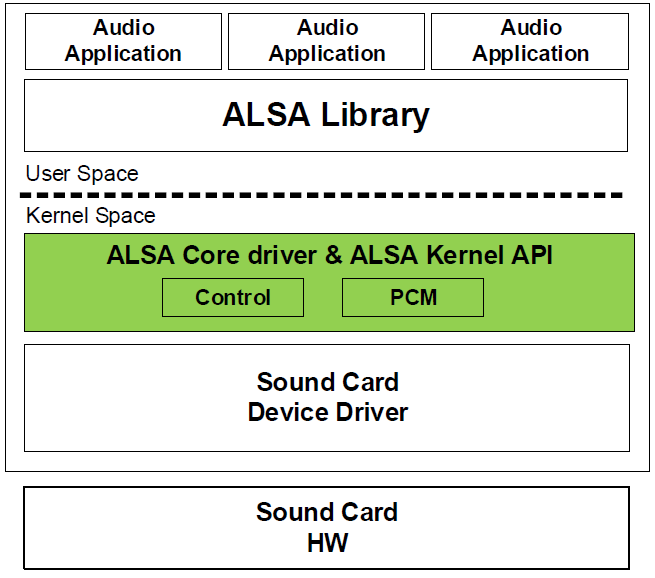
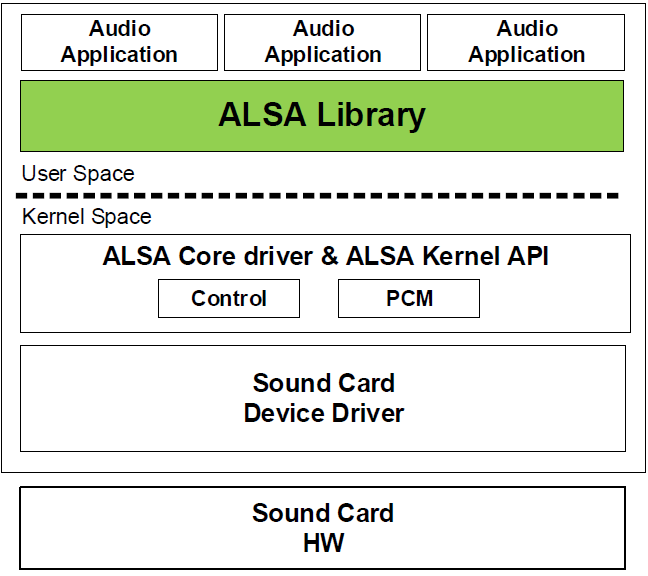
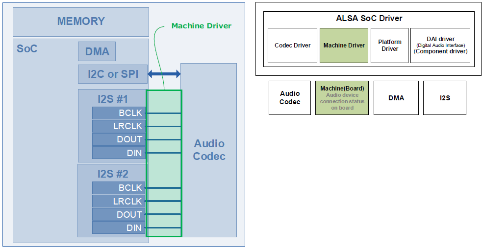
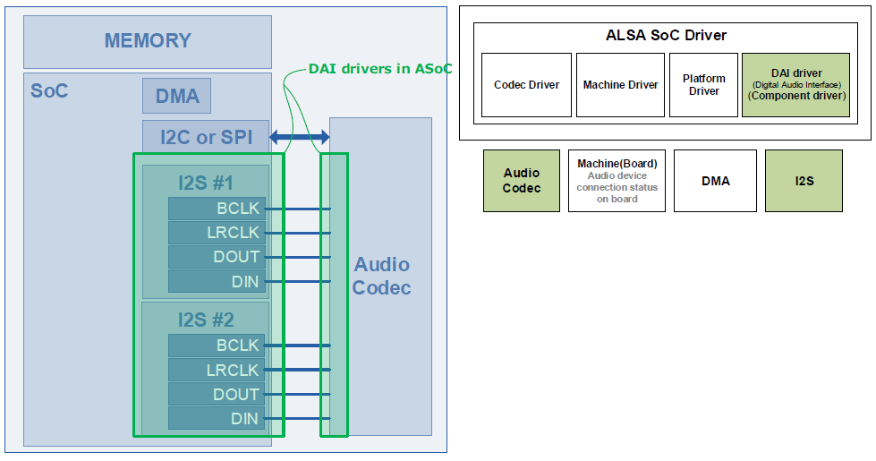

# ALSA

<hr/>

## Introduce ALSA
 - user 영역과 kernel 영역이 나누어져 있고, user영역에서는 ALSA library를 호출하여 사용합니다.
  

 - ALSA Kernel Driver
   * ALSA Kernel Driver는 User space의 System call(open, ioctl, write, read, close)에 대응
   * ALSA Kernel Driver는 User space의 Sound Card Device Drier의 인터페이스를 담당하고 Audio Buffer 및 Signal을 관리 및 운용
  

  - ALSA Library
   * Application에게 공통된 API를 제공하여 ALSA Kernel Driver를 사용 할 수 있도록 합니다.
   * ALSA Library가 /dev/snd/* 경로의 device file을 제어함으로써 Application에서 직접 device file을 제어할 필요가 없습니다.
  


<hr/>

## ALSA directory Architecture

```bash
/kernel/sound$ tree -L 1 -d
.
├── aoa
├── arm
├── atmel
├── core
├── drivers
├── firewire
├── i2c
├── isa
├── mips
├── oss
├── parisc
├── pci
├── pcmcia
├── ppc
├── sh
├── soc
├── sparc
├── spi
├── synth
└── usb

20 directories
```
 1) arm, ppc, sparc 
 	: 각 아키텍처에 specific 한 top-level card 모듈
 2) core  
 	- core/oss : pcm 과 mixer oss 에뮬레이션 코드가 저장되어 있음.
	- core/seq : ALSA sequencer를 위한 서브 디렉토리. sequencer core & primary sequencer 모듈. CONFIG_SND_SEQUENCER가 kernel config에 설정되어 있을때만 컴파일 됨.
	- core/seq/oss : OSS sequencer 에뮬레이션 코드
 3) include 
 	: ALSA 드라이버의 공용 헤더파일들을 위한 디렉토리
 4) drivers 
 	: 서로 다른 아키텍쳐상의 서로 다른 드라이버들 중 공유 코드. ex) pcm driver, serial midi driver
 5) i2c
 	: alsa i2c 컴포넌트 포함.
	: linux상의 표준 i2c가 존재하지만 ALSA는 sound 카드를 위한 전용 i2c를 사용.
 6) oss
 	: oss/lite는 linux 2.6 tree에 여기에 저장됨.
 7) pci
 	: pci 사운드 카드를 사용한 top-level card module과 pci 버스에 특화된 코드.
 8) pcmcia
 	: pcmcia, 특히 pccard 드라이버는 이 디렉토리에 위치함.
 9) synth 
 	: the synth 미드레벨 모듈 포함하고 있음.
 10) soc
 	: embedded system을 위한 driver
 11) usb 
 	: usb-audio driver를 포함.

<hr/>

## ASoC 는 기본적으로 4가지의 driver로 구성됩니다.

 - codec driver : Audio Codec 내 Control을 제어한다. 
	: DAC 또는 AMP를 device에 붙이게 된다면 vendor사에서 기본적으로 제공하는 driver입니다. 또한 sound/soc/codecs directory에도 있으니 참조하면 됩니다.
	: 말 그대로 codec의 특성 및 운영 방법에 대한 명세입니다.
	: ex) sound/soc/codecs/ak7755.c
	

 - platform driver : SoC 내 DMA 및 DAI를 제어
	: stream 제어와 관련된 사항들을 설정하는 부분입니다. raw data, pcm이나 compress data(mp3등)을 출력하기 위해서는 buffer를 control해주어야 하는데, 이와 관련된 부분이 platform driver입니다. 
	;

 - machine driver : embedded board의 audio 관련 device의 연결상태를 선언 및 제어합니다.(sound card등록)
	: sound card를 등록하고 dai(digital audio interface)-i2s 및 codec device 관계를 설정.
	: 기존에 machine driver를 참고하여 개발하거나 기존 reference code를 참고하여 개발하면 됨.
	: ex) sound/soc/tcc/tcc_board_ak7755.c
	;

 - component driver : i2s ip block 및 audio codec내 audio interface(i2s, pcm, pdm 등)을 제어합니다.
	: i2s ip block 및 audio codec 내 audio interface 관계와 관련있습니다. 
	: machine driver에서 dai의 detail이 더해졌다고 생각하면 됩니다.
	;


>A. ALSA 는 X86의 Sound Card를 위해 만들어 졌습니다.
>B. Embedded processor 용에 대응하기 위하여 ALSA System On Chip(SoC) Layer가 존재.
>C. ASoC는 다음 목표로 설계 되었다.
>
>    1) Audio Codec Driver 독립적 및 재사용 가능 하도록 설계
>    2) Audio Codec 과 I2S 및 PCM Audio interfac의 연결을 쉽도록 설계
>    3) Dynamic Audio Power Management(DAPM) 설계 (Audio Codec 내 Power Block 자동 제어 알고리즘)
>    4) Pop 및 Click 잡음 감소 (Audio Codec의 Power를 up/down 하면서 생겨나는 잡음을 줄임)
>    5) Board 특정 컨트롤을 위해 설계. 예를들면 스피커 앰프를 위한 소리 제어
>       (ASoC의 도움 없다면 Audio Function과 별개로 GPIO 제어로 스피커 앰프를 ON/OFF 시켜야 한다)
>
<hr/>

## ALSA Operation Diagram
 - 초록색 Diagram은 PC에서 sound를 출력하는 형태.
 - 붉은색 Diagram은 embedded system에서 sound를 출력하는 형태.
 - 파란색 Diagram은 Android platform에서 sound를 출력하는 형태.
	 
