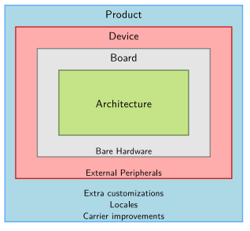
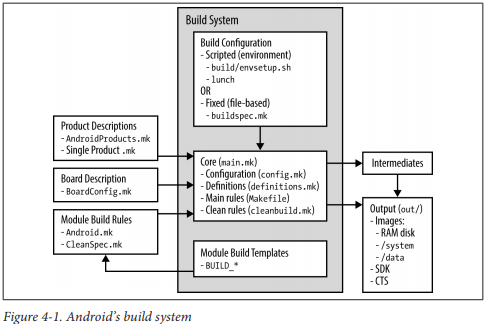
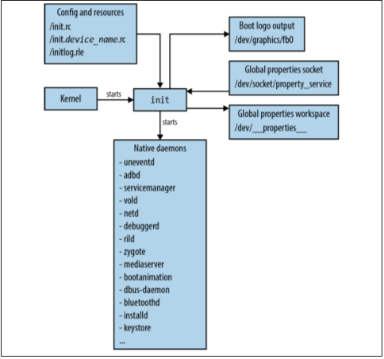

Android source tree
=====
-  **bionic** – bionic libc(BSD의 libc 수정)를 포함  
-  **bootable** - bootloader, recovery mode 관련 코드  
-  **build** - 빌드 관련 스크립트를 저장  
	-  envsetup.sh  
		-  build shell script들이 있음, 툴체인 경로 설정등 환경설정  
	-  generic board에 대한 configuration  
		-  build/target/board/generic/device.mk  
			-  root filesystem의 구성을 어떻게 해야하는가에 대한 방향을 지정하는 파일  
			-  android 최종 결과물 구성시 자동으로 포함하고 싶은 binary들에 대한 install을 결정  
		-  build/target/board/generic/BoardConfig.mk  
			-  Android의 makefile인 Android.mk에 기본적으로 포함되는 최상위 Makefile  
			-  주로 HAL 혹은 기능들에 대한 enable/disable과 관련이 깊음  
			-  Android.mk 파일에 영향을 주고 Android.mk 파일에서 define을 제어할 수 있도록 설정하는 경우가 많음  
			-  ex> BoardConfig.mk의 BOARD_USES_GENERIC_AUDIO := true 의 경우  
				- • frameworks/base/services/audioflinger/Android.mk  
				- • frameworks/base/services/audioflinger/AudioHardwareInterface.cpp  
				- • 파일의 해당 부분을 참조  
-  **CTS** – Compatibility Test Suite관련 소스 디렉토리  
-  **dalvik** - dalvik VM 관련 소스코드  
-  **development** – 개발용 app등…  
-  **device**  
	-  각 vendor에서 만드는 vendor별 device들에 대한 설정파일  
	-  자체 device와 product를 만들기 위해서는 이 디렉토리에서 관련 파일들을 작성하는 것이 좋음  
	-  작성되는 주요 파일 리스트  
		-  AndroidProducts.mk  
			-  Product, device 관련 이름들을 지정  
		-  BoardConfig.mk, device.mk  
			-  generic board에서와 마찬가지 역할을 한다.  
-  **external**  
	-  Android 고유의 library가 아닌 linux 혹은 기존에 작성된 library/binary 소스  
	-  작성된 library 중 shared library(*.so) 파일은 root filesystem의 system/lib 로 install  
	-  작성된 library 중 binary 파일은 root filesystem의 system/bin 으로 install  
	-  framework test app와 library등은 이 디렉토리에서 작업하는게 좋음  
-  **frameworks**  
	-  base/policy  
		-  PhoneWindowManager 소스  
		-  Android 전체 시스템을 background에서 제어하는 최상위 application인 PhoneWindowManager는 다음과 같은 기능을 갖는다  
			-  KeyGuard관련 – LockScreen  
			-  화면 전체 동작 제어(ex> Rotation)  
			-  event 관리 – Key event등  
		-  base – android framework source  
			-  libs/ui  
				-  Android framework에서 JNI를 통해서 호출되는 android client part  
				-  HAL – Input device(key, touch)의 경우  
			-  libs/utils  
				-  Wrapping class, 압축관련 유틸리티 등…  
			-  libs/binder  
				-  Android binder & Anonymous shared memory 제어 클래스  
			-  cmds  
				-  binder관련 binary인 servicemanager 소스와 여러가지 command들  
			-  media  
				-  media관련 JAVA, JNI, Client, Service, Media engine(libstagefright)등의 소스  
				-  media관련은 너무 크고, 독립적이기 때문에 따로 디렉토리를 만들어 관련 소스를 하나의 디렉토리에 넣음  
-  **hardware**  
	-  HAL source & header file – HAL Class의 prototype  
	-  일반적으로 android에서 사용되는 hardware 관련 소스들을 포함, 반드시 이 디렉토리에만 위치하는 것은 아님  
		-  device, vendor 디렉토리에 존재하는 경우가 많음  
	-  libhardware  
		-  board hardware dependency가 높은 하드웨어 모듈들의 example 및 header  
		-  일반적으로 안드로이드 폰에 기본적으로 탑재되지 않고, cpu혹은 제조사의 모듈에 의존성이 높은 부분들에 관련된 class prototype 코드가 있음  
		-  안드로이드 소스 전체를 컴파일 하지 않는 경우도 있고, 모듈단위로 직접 컴파일해서 안드로이드 root filesystem에 install하는 경우도 있음  
		-  Android framework에서 동적으로 module(*.so 파일 형태)을 loading하는 hw_get_module() 함수에 대한 소스가 있음  
			-  hw_get_module()함수는 다음과 같은 순서로 동적 module을 loading한다.  
				- • $(MODULE_NAME).%ro.hardware%.so -> ex> sensors.origen.so  
				- • $(MODULE_NAME).%ro.product.board%.so -> ex> sensors.origenboard.so  
				- • $(MODULE_NAME).%ro.board.platform%.so -> ex> sensors.insignal_origen.so  
				- • $(MODULE_NAME).%ro.arch%.so -> ex> sensors.exynos4.so  
			-  hw_get_module()함수는 rootfs의 system/lib/hw, vendor/lib/hw 디렉토리를 검색  
	-  libhardware_legacy  
		-  일반적으로 android phone에 존재해야 하는 hardware에 대한 제어 코드들이 들어 있음  
		-  Android compile시 같이 컴파일 된다  
		-  ex> wifi/wifi.c  
		-  include/*  
			-  Android built-in HAL의 일부 prototype이 선언되어 있음  
			-  ex> Audio  
-  **packages**  
	-  android 기본 application source  
	-  주의해야할 점은 모든 app가 컴파일 되지 않는다.  
	-  컴파일 되는 패키지들은 각 device별 device.mk에 지정이 되는 PRODUCT_PACKAGES 변수에 포함되어야 함  
	-  ex> build/target/product/generic-no-telephony.mk  
-  **prebuilt**  
	-  toolchain & 필요한 binary  
-  **system**  
	-  android의 root filesystem에 포함되는 기본 binary 소스(ex> init)  
	-  /core/init – android init source  
	-  /vold – vold2, android 2.3 버전서부터 사용됨  
-  **vendor**  
	-  device 디렉토리와 같은 역할  
	-  Android 2.1/2.2 버전에서는 이 디렉토리를 기본 device들에 대한 디렉토리로 사용  
	-  현재(Ice Cream Sandwich)도 이 디렉토리를 사용하는 경우 있음  
-  **out**  
	-  android compile 결과물 디렉토리  
-  **ndk**  
	-  Native Development Kit 관련 파일들이 있음  
	-  docs/ANDROID-MK.html  
		-  Android에서 사용되는 makefile인 Android.mk 파일을 어떻게 작성해야 하는지에 대해서 설명되어 있음  
		-  PDK(Platform Development Kit – Android 소스)에 적용되는 부분에 대한 설명보다는 NDK용 Android.mk 파일에 대한 설명임  
		-  하지만, PDK용 문서로 참고하기 좋음  


-----


AOSP 시스템 설정 값 저장 위치.
=====

* AOSP 시스템 설정 값 위치는 아래 두 위치에 있다.   
[Android Root]에서  
- ./frameworks/base/packages/SettingsProvider/res/values/defaults.xml  
- ./frameworks/base/core/res/res/values/config.xml  
  
보통 장치 제조사의 기본 설정값은 아래의 위치에 있다.  
- ./device/(company name)/(product name)/overlay/frameworks/base/core/res/res/values/config.xml  

빌드 시 위의 파일을 원래 파일에 덮어 쓴다.  


-----
안드로이드의 기본 설정값 및 기본 동작은 아래에서 설명할 파일들을 수정하여 변경 할 수 있다.  
1. 안드로이드 기본 설정값  
```
frameworks/base/packages/SettingsProvider/res/values/defaults.xml
```
> 안드로이드 시스템 설정의 초기값을 정할 수 있다.  이중에는 기기 사용자가 설정에서 변경할 수 없는 것도 있다. 시스템 초기의 WiFi의 On 여부, 기본 값 등.  

2. 안드로이드 시스템 설정  
```
frameworks/base/core/res/res/values/config.xml
```
> 시스템 전반의 동작 유형에 대한 변경을 할 수 있다.  
> MasterVolume, NavigationBar 표시 여부, 전원 버튼 동작 등.  

3. 기본 바탕 화면 이미지를 변경.
```
frameworks/base/core/res/res/drawable-nodpi/default_wallpaper.jpg
```
> 위의 파이를 변경하여 기본 배경 화면 이미지를 변경 할 수 있다.  

4. device 폴더의 overlay 폴더를 이용하여 원본 수정 없이, 각 기기 별 설정을 적용 할 수 있다.  
```
device/<company-name>/<product-name>/overlay/frameworks/base/core/res/res/values/config.xml
```
> overlay 폴더 밑에는 AOSP 프로젝트를 root로 보고, 그 하위에 절대 경로로 폴더 및 파일을 배치하면, 원본을 overlay하게 된다. 이를 이용하여, AOSP 원본을 건드리지 않고도 각 기기에 맞춘 수정이 가능하다.  

5. 또한, vendor 폴더를 이용하여, vendor의 미리 빌드 된 앱, 펌웨어 등을 탑재/이용할 수 있다.   
```
vendor/
```

-----

빌드 설정  
=====

빌드 아키텍쳐  
-----

  

 
> 빌드는 envsetup.sh & lunch 명령의 조합이나 buildspeck.mk 파일을 통해서 최종 빌드 타겟을 설정한다.  
> buildspeck.mk 이용시, build/buildspec.mk.default 를 참조하여 필요한 환경변수를 설정한 뒤, buildspeck.mk를 루트 디렉토리에 저장하면 된다.   
> 아래는 make 명령 시, 설정된 타겟과 관련된 환경변수를 보여준다.  

```
18:56:40 ============================================
18:56:40 PLATFORM_VERSION_CODENAME=REL
18:56:40 PLATFORM_VERSION=8.1.0
18:56:40 TARGET_PRODUCT=full_tcc898x
18:56:40 TARGET_BUILD_VARIANT=eng
18:56:40 TARGET_BUILD_TYPE=release
18:56:40 TARGET_PLATFORM_VERSION=OPM1
18:56:40 TARGET_BUILD_APPS=
18:56:40 TARGET_ARCH=arm
18:56:40 TARGET_ARCH_VARIANT=armv7-a-neon
18:56:40 TARGET_CPU_VARIANT=cortex-a7
18:56:40 TARGET_2ND_ARCH=
18:56:40 TARGET_2ND_ARCH_VARIANT=
18:56:40 TARGET_2ND_CPU_VARIANT=
18:56:40 HOST_ARCH=x86_64
18:56:40 HOST_2ND_ARCH=x86
18:56:40 HOST_OS=linux
18:56:40 HOST_OS_EXTRA=Linux-5.3.0-62-generic-x86_64-with-Ubuntu-16.04-xenial
18:56:40 HOST_CROSS_OS=windows
18:56:40 HOST_CROSS_ARCH=x86
18:56:40 HOST_CROSS_2ND_ARCH=x86_64
18:56:40 HOST_BUILD_TYPE=release
18:56:40 BUILD_ID=OMC1.180417.001
18:56:40 OUT_DIR=out
18:56:40 AUX_OS_VARIANT_LIST=
18:56:40 ============================================
```
  
> 타겟 디바이스 설정은 build/make/target/product/ 과 device/*/*/ 에 존재하는 AndroidProducts.mk 에서 시작한다.   
> lunch에서 표시되는 타겟리스트는 master:/device/*/*/AndroidProducts.mk 에서 COMMON_LUNCH_CHOICES와/device/*/*/vendorsetup.sh 에서 add_lunch_combo()로 추가되는 LUNCH_MENU_CHOICES에 저장된 리스트를 표시한다.   
> add_lunch_combo() 는 /device/*/*/vendorsetup.sh 에서 호출된다.  
> 커널파라미터, 커널로딩 주소, CPU instruction set 등을 결정하는 BoardConfig.mk는 device/*/TARGET_DEVICE/BoardConfig.mk 에 존재한다.  


envsetup.sh
-----
> 소스 검색, 빌드 타겟 확인 등 여러가지 빌드 설정(lunch) 및 빌드 디버깅 기능을 제공한다.   
이 스크립트에서 정의된 명령은 vendorsetup.sh 에서도 사용 할 수 있다.  

* 도움말 :   
```  
$ hmm  
```  

* 파일 검색 명령(AndroidProduct.mk) :  
```
lchy0113@cfc0c6849124:~/Develop/Telechips/NHN-1033_GERRIT$ godir
Usage: godir <regex>
lchy0113@cfc0c6849124:~/Develop/Telechips/NHN-1033_GERRIT$ godir AndroidProducts.mk
Creating index... Done

   [1] ./build/make/target/product
   [2] ./device/asus/fugu
   [3] ./device/generic/arm64
   [4] ./device/generic/armv7-a-neon
   [5] ./device/generic/car
   [6] ./device/generic/mini-emulator-arm64
   [7] ./device/generic/mini-emulator-armv7-a-neon
   [8] ./device/generic/mini-emulator-mips
   [9] ./device/generic/mini-emulator-mips64
  [10] ./device/generic/mini-emulator-x86
  [11] ./device/generic/mini-emulator-x86_64
  [12] ./device/generic/mips
  [13] ./device/generic/mips64
  [14] ./device/generic/qemu
  [15] ./device/generic/uml
  [16] ./device/generic/x86
  [17] ./device/generic/x86_64
  [18] ./device/google/dragon
  [19] ./device/google/marlin
  [20] ./device/google/muskie
  [21] ./device/google/taimen
  [22] ./device/huawei/angler
  [23] ./device/lge/bullhead
  [24] ./device/linaro/hikey
  [25] ./device/sample/products
  [26] ./device/telechips/tcc898x

Select one: 26
lchy0113@cfc0c6849124:~/Develop/Telechips/NHN-1033_GERRIT/device/telechips/tcc898x$ 
```
  
vendorsetup.sh  
-----
> build/envsetup.sh에 의해 실행되며 주요 기능은 add_lunch_combo()를 이용해 envsetup.sh와 lunch에서 사용할 빌드 타겟을 설정한다. 

* envsetup.sh 에서 정의된 모든 함수를 사용할 수 있다.  
* 아래 처럼 호출하면 TARGET_PRODUCT=full_tcc898x, TARGET_BUILD_VARIANT=eng 으로 설정된다.   
* 설치되는 각 모듈은 LOCAL_MODULE_TAGS 변수에 user, debug, eng, tests, optional, samples 중 하나로 설정되며 TARGET_BUILD_VARIANT에 설정된 값에 매치되는 모듈이 빌드 된다.  
```
$ add_lunch_combo full_tcc898x-eng
```

  
AndroidProducts.mk
-----
> 빌드 시스템에 전달할 makefile 리스트인 PRODUCT_MAKEFILES을 설정한다.  
> 이 파일이 적용시 LOCAL_DIR 외 다른 변수는 설정된 것이 없으므로 다른 변수를 이용한 조건문은 불가능하다.  
* 아래는 Telechips 사의 TCC898x 의 설정이다.  

```
PRODUCT_MAKEFILE := \
    $(LOCAL_DIR)/full_tcc898x.mk
```

  
device/company/*/PRODUCT_MAKEFILE 
-----
> AndroidProduct.mk에서 작성한 제품별 빌드파일로 제품이름 인스톨 패키지 등을 설정한다.  

* PRODUCT_PACKAGES:
> 추가할 패키지를 지정한다. 

* DEVICE_PACKAGE_OVERLAYS:
> 기본 패키지 리소스를 기기에 특화된 리소스로 대체한다.

* PRODUCT_COPY_FILES:
> 대상 파일시스템에 복사할 파일을 지정한다.

* PRODUCT_NAME:
> 사용자에게 노출되는 제품 이름.

* PRODUCT_DEVICE:
> 이 변수와 같은 폴더의 BoardConfig.mk를 적용한다.

* PRODUCT_MODEL:
> 사용자에게 노출된 모델 이름.

* vendor prebuilt makefile  추가됨. (아래 강조 참고).

* 나머지 변수의 의미 참고 : [Product Definition Variables](https://source.android.com/setup/develop/new-device#prod-def, "google link")   

```
# Build option for TV device
TV_DEVICE_BUILD := true
CTS_BUILD := false

ifeq ($(TV_DEVICE_BUILD),true)
$(call inherit-product, device/google/atv/products/atv_base.mk)
else
$(call inherit-product, $(SRC_TARGET_DIR)/product/full_base.mk)
endif

ifeq ($(TV_DEVICE_BUILD),true)
TV_DEVICE_CTS_CDD342_PASS_BUILD := false
endif

# How this product is called in the build system
PRODUCT_NAME := full_tcc898x
PRODUCT_DEVICE := tcc898x
PRODUCT_BRAND := Android
PRODUCT_MANUFACTURER := kdiwin 

# Define the name of target board                                                                                                                                                                                 
#TARGET_BOARD_8980_STB := true
TARGET_BOARD_8985_OTT := true
#TARGET_BOARD_8985_STICK := true

ifeq ($(TV_DEVICE_BUILD),true)
#PRODUCT_CHARACTERISTICS := tv,sdcard
PRODUCT_CHARACTERISTICS := tablet,sdcard
else
PRODUCT_CHARACTERISTICS := tablet,sdcard
endif
#PRODUCT_TAGS += nand_v8

# The user-visible product name
ifeq ($(TARGET_BOARD_8980_STB),true)
PRODUCT_MODEL := TCC8980_STB
endif

ifeq ($(TARGET_BOARD_8985_OTT),true)
PRODUCT_MODEL := NHN-1033
endif

ifeq ($(TARGET_BOARD_8985_STICK),true)
PRODUCT_MODEL := TCC8985_STICK
endif
```

build/core/main.mk
-----
> 최상단 Makefile에 의해 호출되며 build/core/config.mk, build/core/definitions.mk 등 호출해 빌드에 필요한 변수 설정이나 빌드 템플릿을 설정한다.  

build/core/config.mk
-----
* include $(TOPDIR)buildspec.mk  을 수행하여 빌드타겟 설정을 하며 만약 파일이 없으면 환경변수를 이용한다.  
* include $(BUILD_SYSTEM)envsetup.mk 을 수행하여 envsetup.sh 에서 설정한 환경변수를 적용한다.  

build/core/envsetup.mk
-----
> 아래를 호출하여 빌드 버전과 빌드 타겟( eng / user ) 을 설정한다. 
* include $(BUILD_SYSTEM)/version_defaults.mk
* include $(BUILD_SYSTEM)/product_config.mk


include $(BUILD_SYSTEM)/version_defaults.mk
> 아래 다양한 빌드 버전 변수를 설정한다.
```
PLATFORM_VERSION
PLATFORM_SDK_VERSION
PLATFORM_VERSION_CODENAME
DEFAULT_APP_TARGET_SDK
BUILD_ID
BUILD_NUMBER
```
* include $(BUILD_SYSTEM)build_id.mk 를 통해 BUILD_ID를 설정한다.
* BUILD_ID 가 아래처럼 안드로이드 빌드 아이디로 표시된다.
```
BUILD_ID=OMC1.180417.001
```

build/core/makefile
-----
> 이 파일을 통해 여러가지 결과물이 생성되며 주요 사항은 아래와 같다.
* 속성파일들(/default.prop, /system/build.prop) 등.
* 램디스크.
* 부트 이미지(램디스크와 커널 이미지).
* 공지(NOTICE)파일들: 아파치 라이센스 관련 파일.
* OTA 키스토어.
* 복구이미지.
* 시스템 이미지.
* 데이터 파티션 이미지.
* OTA 업데이트 패키지.
* SDK.

BoardConfig.mk
-----
> 각 디바이스에 해당하는 모드설정을 한다.
* device/*/TARGET_DEVICE/BoardConfig.mk 에 위치한다.
* TARGET_DEVICE는 AndroidProducts.mk에서 설정한 TARGET_PRODUCT.mk에서 설정된다. 
* 커널 파라미터, 커널로딩 주소.
* CPU instruction set.
* sepolicy.
* 파일시스템 파티션 사이즈 등을 결정한다.


Build/buildspec.mk.default
-----
> buildspec.mk 의 템플릿으로 루트디렉토리에 buildspec.mk 로 복사한 후 필요한 설정은 주석을 제거하여 적용이 되도록 수정하면 된다. 

Makefile 디버깅
=====


빌드시 GCC 명령 보기.
-----
* make showcommands
* 표준출력과 표준에러를 파일에 기록; make showcommands 2>&1 | tell build.log

개별 모듈 빌드하기.
-----
* 런처만 빌드 : make Launcher2
* 런처만 초기화 : make clean-Launcher2
* 갱신된 런처를 시스템이미지에 추가 : make Launcher2 snod


새로운 기기 추가를 위한 설정
-----
안드로이드 제공 문서 참조 : [https://source.android.com/setup/develop/new-device]: https://source.android.com/setup/develop/new-device

1. 새로운 기기들의 빌드 파일 리스트를 설정한 파일 AndroidProduct.mk 를 생성한다. 
```
$ mkdir -p device/(MY_COMPANY)/(MY_DEVICE)
$ vi device(MY_COMPANY)/(MY_DEVICE)/AndroidProduct.mk
PRODUCT_MAKEFILES := \
	$(LOCAL_DIR)full_(MY_DEVICE).mk
```

2. 새로운 제품의 빌드파일을 작성한다. 필요한 경우 inherit-product 를 이용해 기존 빌드 설정을 추가한다. 
PRODUCT_DEVICE에 설정된 이름과 같은 디렉토리의 BoardConfig.mk를 적용하게 된다.
```
$ vi device/(MY_COMPANY)/(MY_DEVICE)/full_(MY_DEVICE).mk
$(call inherit-product, $(SRC_TARGET_DIR)/product/full_base.mk)
$(call inherit-product, $(SRC_TARGET_DIR0/board/generic/device.mk)

# Overrides
PRODUCT_NAME := full_(MY_DEVICE)
PRODUCT_DEVICE := (MY_DEVICE)
PRODUCT_BRAND := Android
PRODUCT_MODEL := Full Android on mydevice
```

ex.)

```
$ vi device/telechips/tcc898x/full_tcc898x.mk

ifeq ($(TV_DEVICE_BUILD),true)
$(call inherit-product, device/google/atv/products/atv_base.mk)
else
$(call inherit-product, $(SRC_TARGET_DIR)/product/full_base.mk)
endif

ifeq ($(TV_DEVICE_BUILD),true)
TV_DEVICE_CTS_CDD342_PASS_BUILD := false
endif

# How this product is called in the build system
PRODUCT_NAME := full_tcc898x
PRODUCT_DEVICE := tcc898x
PRODUCT_BRAND := Android
PRODUCT_MANUFACTURER := kdiwin 
```

3. envsetup.sh와 lunch 메뉴에서 추가한 기기를 표시할 수 있도록 vendorsetup.sh를 작성한다.
```
$ vi device/(MY_COMPANY)/(MY_DEVICE)/vendorsetup.sh
add_lunch_combo full_tcc898x-eng
$ chmod 755 vendorsetup.sh
```

4. 새로운 기기의 보드에 해당하는 설정을 BoardCofnig.mk 에 작성한다.
```
$ vi device/(MY_COMPANY)/(MY_DEVICE)vendorsetup.sh
```

5. 빌드를 한다. 빌드된 이미지의 내용은 아래 폴더(out/target/product/product-name/)에서 확인 할 수 있다. 
* ramdisk.img: /root
* vendor.img: /vendor
* system.img: /system
* userdata.img: /data
* recovery.img: /recovery

  
빌드 시 커널 폴더 추가하기.
-----
1. 최상의 디렉토리에 커널을 추가한다.

2. 아래 처럼 vendor폴더 추가 스크립트를 적용하는 스크립트를 작성한다.
(작성 예정)

3. product envsetup에 커널 빌드함수를 작성한다.
(작성 예정)


  
루트 디렉토리(Device)
-----
* /acct : cgroup 마운트 디렉토리.
* /cache : 진행 중인 다운로드 등 임시데이터 저장.
* /charger : 배터리 충전 상태를 알려주는 네이티브 앱.
* /config : configs 마운트 디렉토리.
* /d : /sys/kernel/debug 심볼릭 링크.
* /data : userdata.img 마운트 디렉토리.
 - /anr : ANR 트레이스.
 - /app : 앱의 기본 설치 디렉토리.
 - /app-asec : 암호화된 앱.
 - /app-private : forward locking된 앱의 설치 디렉토리.
 - /backup : Backup Manager 시스템 서비스가 사용한다.
 - /dalvik-cache : dex 바이트 코드를 네이티브코드로 변환된 JIT 캐시를 지정한다.
 - /data : 각 앱의 홈 데릭토리.
 - /dontpanic : dumpstate가 사용, 발생된 패닉의 콘솔 출력과 스레드 상태를 저장한다.
 - /drm : DRM 암호화된 데이터, 포워드 락킹 통제 파일.
 - /local : shell에서 쓰기가 가능한 디렉토리.
 - /mis : wifi, BT, VPN 등 잡다한 데이터가 저장된다.
 - /property : 영구적인 시스템 속성.
 - /resource-cache : 앱 자원 캐시.
 - /radio : 라디오 펌웨어.
 - /secure : 암호화된 파일시스템을 사용하는 기기에서 사용하는 계정정보 저장.
 - /system : 계정 데이터 베이스, 설치된 앱 목록 등 모든 시스템에서 사용하는 데이터.
 - /tombstones : 네이티브 바이너리가 비정상 종료될때마다 관련 정보를 저장.
 - /usr : 다중 사용자 시스템을 위한 사용자별 데이터.
* /dev : tmpfs로 마운트 됨. 장치노드가 생성됨.
* /etc : /system/etc 심볼릭 링크.
* /mnt : 임시 마운트 디렉토리.
* /proc : procfs 마운트 디렉토리.
* /root : root 사용자 홈 디렉토리, 보통 비어있음.
* /sbin : 리눅스와 달리 ueventd, watchdogd 심볼릭 링크와 charger를 포함.
* /sdcard : SD카드 마운트 디렉토리.
* /storage : 외부 저장소 마운트 디렉토리.
* /sys : sysfs 마운트 디렉토리.
* /system : system.img 마운트 디렉토리, 읽기 전용.
    - /app : AOSP 기본 앱,  BUILD_PACKAGE로 빌드된 모듈.
    - /bin : AOSP 로 빌드된 네이티브 바이너리 및 데몬, BUILD_EXECUTALBE로 빌드된 모듈.
    - /etc : 유틸리티 및 데몬에서 사용하는 설정파일.
    - /fake-libs : art/libart_fake/README.md 말하길 일부 앱에서 잘못된 구현으로 링크가 필요한 라이브러리.
    - /fake-libs64
    - /fonts : 안드로이드용 폰트.
    - /frameworks : 프레임워크 jar파일.
    - /lib : 네이티브 라이브러리 BUILD_SHARED_LIBRARY로 빌드된 모듈.
    - /lib64
    - /media : 부트 애니매이션 및 기타 미디어 관련파일.
    - /priv-app : signatureOrSystem 권한이 필요한 privileged app. app manifest에서 앱 권한을 설정한다.
    - /tts : 텍스트 음석 변환(Text-to-Speech)엔진 관련 파일.
    - /usr : 사용자 계정 디렉토리.
    - /xbin : tcpdump, strace등 시스템동작에 필요 없지만, 빌드된 패키지가 생성한 바이너리.
    - /build.prop : 빌드중 생성된 속성. 부팅시 init이 로드 한다.
* /res : chareger 앱의 리소스 파일.
* /vendor : 심볼릭 링크(/system/vendor), vendor 독점 바이너리를 포함. 
* /init : init 실행파일.
* /init.rc : init 설정파일.
* /ueventd.rc : ueventd 설정파일.
* /default.prop : 기본으로 설정되는 전역 속성.


init 프로세스
-----
 커널이 램디스크를 루트파일시스템으로 마운트 한 후, 램디스크에 포함된 init 프로세스를 실행한다.




init프로세스 수행절차
-----
1. init은 udev의 핫플러그 이벤트 핸들러를 구현하고 있으므로, init이 /sbin/ueventd를 통해 호출이 됐으면 ueventd를 실행한다.
2. /dev, /proc, /sys 를 생성하고 마운트 한다.
3. /init.rc, /init.(MY_DEVICE).rc 를 시스템에 반영한다.
4. 종료되었거나 재시작이 필요한 서비스를 다시 실행한다.


init.rc
-----
* 전역속성 설정파일.
* 문법은 system/core/init/README.md 에서 확인할 수 있다. ( [번역](http://taehyo.egloos.com/4129642) )
* 실행 시, stdout, stderr을 /dev/null 로 전달하기 때문에 출력 메시지를 확인 하려면 logwrapper을 이용해야 한다. 
* /out/../system/default.prop에 핵심 속성의 기본값을 포함한다.  빌드시 변경하려면 AndroidProducts.mk 에서 PRODUCT_PROPERTY_OVERRIDES 를 통해서 변경한다.


ueventd
-----
ueventd는 기본 init.rc 가 실행하는 최초의 서비스 중 하나다. 설정파일을 읽어 들여 커널 이벤트에 따라 /dev에 노드를 생성한다.

~[](image/ANDROID_SOURCE_TREE_3.png)

1. ueventd의 설정파일 문법.
```
/dev/<node>    <mode>    <user>    <group>
```

2. uevent operation 참조 : [쾌도난마](http://egloos.zum.com/furmuwon/v/11024590)   , [RS](http://egloos.zum.com/embedded21/v/1864518)


ToolBox
-----
* init의 전역속성을 제어.
 - getprop <key> : 속성 확인.
 - setprop <key> <value> : 속성 변경.
 - watchprops : 실시간 속성 감시.

* 이벤트 확인 및 전달.
 - getevent
 - sendevent /dev/input/event0 1 330 1

* 서비스 제어
 - start <servicename>
 - stop <servicename>, ex> stop zygote

* 베이스벤트 프로세서 제어.
 - smd

* ramdisk.img 마운트하기
 램디스크 이미지는 압축파일 이므로 아래와 같이 압축을 풀면된다. /root 의 내용과 같다.
```
lchy0113@KDIWIN-NB:~/Develop/Telechips/NHN-1033/out/target/product/tcc898x/temp_dir$ gunzip -c ramdisk.img | cpio -idm
6246 blocks
lchy0113@KDIWIN-NB:~/Develop/Telechips/NHN-1033/out/target/product/tcc898x/temp_dir$ ls
acct             init.factory.rc                init.tcc898x.tztee.tzos.rc     ramdisk.img
bugreports       initlogo.rle                   init.tcc898x.usb.rc            res
cache            init.rc                        init.tcc898x.wifi.broadcom.rc  sbin
charger          init.recovery.tcc898x.emmc.rc  init.tcc898x.wifi.marvell.rc   sdcard
config           init.recovery.tcc898x.nand.rc  init.tcc898x.wifi.realtek.rc   storage
d                init.recovery.tcc898x.rc       init.usb.configfs.rc           sys
data             init.tcc898x.emmc.rc           init.usb.rc                    system
default.prop     init.tcc898x.hdcp2.hdmi.rc     init.zygote32.rc               ueventd.rc
dev              init.tcc898x.nand.rc           lib                            ueventd.tcc898x.rc
etc              init.tcc898x.rc                mnt                            vendor
init             init.tcc898x.setupfs.rc        oem
init.environ.rc  init.tcc898x.tztee.rc          proc
```


기본 권한 및 소유권 
-----
* 사용자/그룹 생성 설정.
 build/tools/fs_config 가 /system/core/include/private/android_filesystem_config.h 를 참조하여 설정된다. 

* 디렉토리와 파일 권한.
 - system/core/libcutils/fs_config.cpp 아래 구조체에 따라 설정된다.


모듈 빌드 Android.mk
-----
안드로이드 시스템 각 모듈의 빌드 파일로서,  각 모듈을 실행파일 또는 동적 및 정적 라이브러리로 만들 수 있다. 

* Module-Description 변수(LOCAL_XXX)
* LOCAL_로 시작하는 변수를 통해 동작과 결과물을 조절할 수 있다.
 LOCAL 변수 참조 : [https://developer.android.com/ndk/guides/android_mk?hl=ko](https://developer.android.com/ndk/guides/android_mk?hl=ko)
* 컴파일 결과물 설치위치는 빌드템플릿(BUILD_XXX) 에 따라 정해진다.  설치 위치를 변경하려면 LOCAL_MODULE_PATH를 이용한다.
* 빌드템플릿과 출력 경로.
 | 탬플릿               | 기본출력 경로                         |
 |----------------------|---------------------------------------|
 | BUILD_EXECUTEABLE    | /system/bin                           |
 | BUILD_JAVA_LIBRARY   | /system/framework                     |
 | BUILD_SHARED_LIBRARY | /system/lib                           |
 | BUILD_PREBUILT       | LOCAL_MODULE_CLASS/PATH로 설정해야 함 |
 | BUILD_MULTI_PREBUILT | 모듈의 유형에 따라 다름               |
 | BUILD_PACKAGE        | /system/app                           |
 | BUILD_KEY_CAHR_MAP   | /system/usr/keychars                  |
* 빌드 탬플릿(BUILD_XXX)
* BUILD_STATIC/SHARED_LIBRARY : 빌드 타겟용 공유/정적 라이브러리로 빌드한다.
* BUILD_EXECUTABLE : 빌드 타겟용 실행파일로 빌드한다.

ex) packages/apps/Camera2/Android.mk
```
LOCAL_PATH:= $(call my-dir)                                                                                                                                                                                       

include $(CLEAR_VARS)

LOCAL_MODULE_TAGS := optional

LOCAL_STATIC_JAVA_LIBRARIES := android-support-v13
LOCAL_STATIC_JAVA_LIBRARIES += android-ex-camera2-portability
LOCAL_STATIC_JAVA_LIBRARIES += xmp_toolkit
LOCAL_STATIC_JAVA_LIBRARIES += glide
LOCAL_STATIC_JAVA_LIBRARIES += guava
LOCAL_STATIC_JAVA_LIBRARIES += jsr305

LOCAL_SRC_FILES := $(call all-java-files-under, src)
LOCAL_SRC_FILES += $(call all-java-files-under, src_pd)
LOCAL_SRC_FILES += $(call all-java-files-under, src_pd_gcam)

LOCAL_RESOURCE_DIR += \
    $(LOCAL_PATH)/res \
    $(LOCAL_PATH)/res_p


include $(LOCAL_PATH)/version.mk
LOCAL_AAPT_FLAGS := \
        --auto-add-overlay \
        --version-name "$(version_name_package)" \
        --version-code $(version_code_package) \
(리소스 관리 툴 설정)

LOCAL_PACKAGE_NAME := Camera2

LOCAL_SDK_VERSION := current

LOCAL_PROGUARD_FLAG_FILES := proguard.flags
(소스 난독화 툴 프로가드 설정)

# Guava uses deprecated org.apache.http.legacy classes.
LOCAL_JAVA_LIBRARIES += org.apache.http.legacy

LOCAL_JNI_SHARED_LIBRARIES := libjni_tinyplanet libjni_jpegutil

include $(BUILD_PACKAGE)

include $(call all-makefiles-under, $(LOCAL_PATH))
```

TIPS
-----
* 안드로이드에 이더넷 기능 추가하기. 
 - ICS 4.0.4 패치 : [https://github.com/gxben/aosp-ethernet](https://github.com/gxben/aosp-ethernet)
 - 리나로 패치 : 

* 파일 시스템 하나만 사용하기.
 - RowBoat : [https://code.google.com/archive/p/rowboat/](https://code.google.com/archive/p/rowboat/)


* Reference : http://shincdevnote.blogspot.com/2018/11/aosp-build.html
