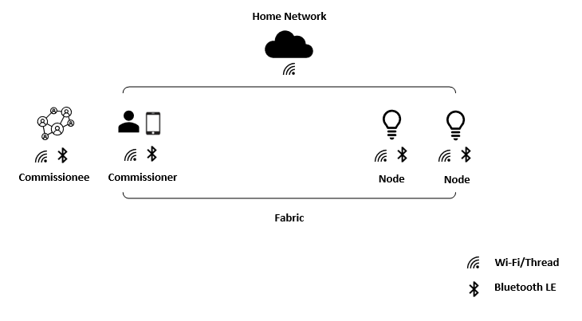
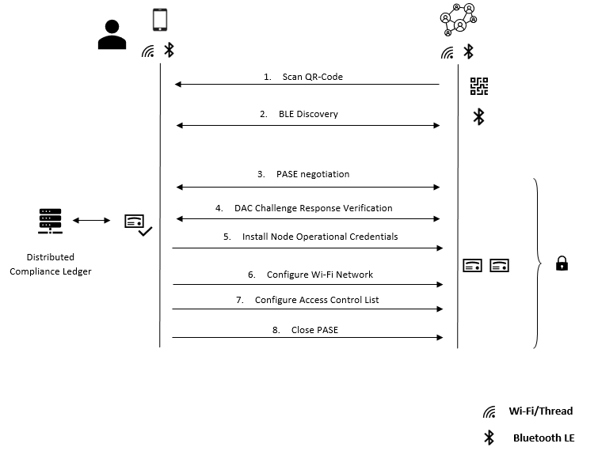
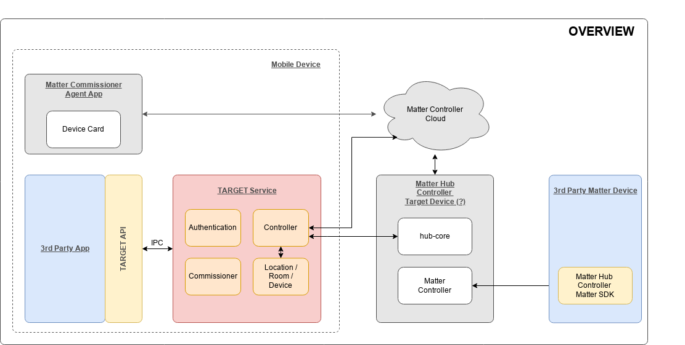

Matter 
=====

> IP 기반 Home IOT 통신 표준

<br/>

-----

# Open-source Matter SDK
  
> Connected Home Over IP 는 Google, Amazon, Apple, Zigbee Alliance 등이 함께 개발한 IoT 기기 간의 상호 운용성을 향상시키기 위한 개방형 표준.  
> 이 표준은 Wi-Fi, Thread, Bluetooth LE 등 다양한 프로토콜을 지원하며, 사용자는 다양한 제조사의 IoT기기를 하나의 허브에서 관리 가능.
  
 - [ConnectedHomeIP](https://github.com/project-chip/connectedhomeip) 
  
<br/>

-----

# Matter Study
> Matter 의 원칙은 Local Control

## 용어 정리

 - *Matter Hub*   
   Matter Hub는 컨트롤러가 연결되고 통합하는 중앙 장치.   
   허브는 네트워크의 다양한 장치를 관리하는데 도움 된다.   
   이를 통한 한 위치의 단일 액세스 포인트에 연결된 장치를 제어할 수 있다.   
   하나의 단일 플랫폼에서 다양한 Matter 스마트 홈 장치를 추가,제어 및 관리하려면 Matter Hub가 필요하다.  
   * Amazon Echo/Alexa devices  
   * Google Home/Nest Hub products  
   * Apple HomePod  
  
     
  
 - *Matter Bridge*    
   Matter Bridge 는 Matter 가 아닌 제품을 Matter 생태계로 가져올 수 있는 장치이다.  
   장치 사이의 중개자 역할이며, 예를들어 오래된 Zigbee 플러그가 있는 경우, Matter Bridge를 통해  
   Matter 네트워크에 연결할 수 있다. Bridge는 호환성을 허용하는 두 프로토콜 간을 변환하는 역할을 한다.  
  
   Bridge는 기존 스마트홈 기술을 새로운 Matter 장치와 통합하는데 도움이 된다.   
   이들은 Legacy 제품을 새로운 표준으로 끌어올린다.   
   Zigbee, Z Wave, Bluetooth 장치를 Matter가 아닌 장치를 Matter 지원 장치로 사용할 수 있다.   
  
     
  
 - Matter Hub 와 Matter Bridge 간 차이점  
   Hub는 Matter 네트워크의 주요 액세스 포인트 이고, Bridge 는 다른 프로토콜에 연결된다.   
   Hub는 원격 제어 및 자동화를 가능하게 하고, Bridge는 translation 과 compatibility에 중점을 둔다.  
   Matter 설정에는 하나의 Hub만 필요하지만 translation에는 여러개의 Bridge가 있을 수 있다.   
   요약하면 *Hub는 중앙컨트롤러이고, Bridge는 다른 표준에 대한 translation 역할을 한다.*  
  
   ref : https://help.ewelink.cc/hc/en-us/articles/23868490214169-Matter-Hub-vs-Matter-Bridge-What-s-the-Difference-  
  
  
 - *homeBridge*  
   HomeBridge는 Ring 및 Nest 와 같은 브랜드의 HomeKit 세서리를 지원하기 위해 HomeKit을 모조하는 무료 오픈 소스 소프트웨어이다. PC, Mac과 같이 항상 켜져 있는 장치에서 서버 소프트웨어와 추가하려는 액세서리의 종류에 대한 플러그인을 설치해야 한다.  
    site : https://homebridge.io/  
	study : https://github.com/Orachigami/homebridge-android  
  
	* Matter 와 HomeBridge관 관계
	  Matter를 지원하는 장치는 스마트 홈에 연결하기 위해 HomeBridge를 통할 필요가 없다. 
      현재 Matter 표준은 제한된 장치 유형(조명, 도어장금장치, 센서, 스피커 등)만 지원하고 있기때문에, 
	  HomeBridge를 통해 제한적인 장치를 Matter 플랫폼에 지원 할 수 있도록 할수 있다. 
  
 - *Third party border router*  
   thrid-party border router 를 사용하면 기존 thread 인터페이스를 제공하지 않는 Hub에서 thread 인터페이스로 연결되는 Matter 장치를 연결할수 있다.  
   thread Boarder 라우터는 thread network를 local IP network, WiFi or Ethernet 에 연결하기 위해 Matter protocol을 사용하여 thread 장치와 Controller간의 연결을 위한 Access porint 역할을 한다.

<br/>
<br/>
<br/>

## Matter 장치를 사용하려면 필요한 것.


 - **Matter Commissioner**   
   on-bording 프로세스 과정에서 Matter Device를 Matter Controller에 연결하는데 사용된다.   
   예를들어, SmartThings App이 설치된 모바일 장치가 이러한 연결을 수행하는 역할을 한다.  
  
 - **Matter Controller**  
   Matter Device 가 on-bording 된 후, 이를 제어하는 Hub 역할을 한다.  
   Thread 기반 장치를 연결하려면 Thread Boarder Router 가 포함된 Matter Controller가 필요하다.  
   
 - **Matter Device**  
   제어할 스마트 홈 장치이다.  장치에 Matter Badge가 있는 경우 서비스를 제공한다.  

<br/>
<br/>
<br/>
  
## Matter 가 작동하는 방식

 Matter 는 wifi, ethernet, thread와 같이 잘 알려진 ip 네트워크 위에 구축되는 애플리케이션 계층 프로토콜.  
 또한 저전력 bluetooth(ble)는 네트워크 형성 디바이스 식별 및 로직 구성과 관련된 프로세스인 무선 네트워크 커미셔닝에 사용됨.  


  
### 1. Matter 장치 연결

 Matter 애플리케이션 계층 프로토콜의 소프트웨어 인프라를 통해 사용자는 QR코드를 스캔하는 간단한 동작을 통해 새로운 Matter 기기를 연결할 수 있다.   
 Matter 기기의 QR코드에 내장된 몇 가지 주요정보를 통해 가능  

 - version
 - vendor id
 - product id
 - custom flow
 - discovery capabilities
 - discriminator
 - passcode
 - padding
 - tlv data

 > 스캔하면 스마트폰의 ble기능이 활성화되어 matter기기를 매핑하고 식별할 수 있다.   
 > 그 후, QR코드에 포함된 정보를 기반으로 커미셔닝 시작.

### 2. commissioner와 Matter 디바이스간의 연결 시운전 및 보안 유지

 commissioner과 Matter 기기간의 통신은 암호 인증 세션 프로토콜(PASE)을 통해 보호됨.  
 비밀번호는 QR코드에 내장된 비밀번호 기반 키 도출 함수(PBKDF)를 통해 생성.  
 설정된 비밀번호 키는 Matter 네트워크에서 두 기기 간에 교환되는 메시지의 암호화, 인증, 개인정보 보호에 차례로 사용됨.  



 이 시나리오에서 commissioner 역할을 하는 스마트폰은 수신 장치에 합법성과 신원을 확인하기 위해 장치 증명 자격증명(DAC)을 제공하도록 요청함.  
 허가를 받으면 commissioner는 나중에 인증 및 통신 목적으로 사용되는 노드 운영 자격증명(NOC) 을 기기에 생성하고 설치함. 

 BLE는 기본 통신 모드로 사용되지 않으며, 무선 네트워크에도 자격 증명을 제공해야 한다.  (현재 wifi, thread가 지원)  
 이를 용이하게 하기 위해 commissioner는 기본적으로 네트워크의 모든 디바이스에 특정 작업을 수행 할 수 있는 권한을 부여하는 목록인 액세스 제어 목록에 관리자로 추가된다.  
 커미셔닝이 완료되면 새 장치가 네트워크(thread, wifi)에 추가되고 ble 세션이 닫힌다.   
 이전에 연결되었던 모든 matter 기기느 ㄴ이제 새기기와 안전하게 통신할 수 있는 상태가 된다.  

<br/>
<br/>
<br/>

-----

# Matter(formerly Project CHIP) 

>  이전에는 Project CHIP라고 불렸으며, 매터(Matter)로 변경됨.   
  
 : https://github.com/project-chip/connectedhomeip

## Matter stack 

  아래 architecture 는 layer 간 역할과 기능을 적절하게 분리하여 서비스를 제공한다.

  1. *Application*  
    장치의 High-order business logic. 예) 조명 기능을 갖춘 애플리케이션에는 조명 켜기/끄기와 같은 기능을 처리함.  
  
  2. *Data model*  
    Application layer에서 사용되는 data 및 기능. Application layer의 기능에 필요한 데이터 모델을 관리.  
  
  3. *Interaction model*  
    Interaction model layer에서는 client와 server 장치간에 수행할 수 있는 상호 동작 기능을 정의한다.   
	예를 들어, 서버 장치에서 속성을 read/write하는 것에 대한 동작을 수행한다.  이러한 상호 동작 기능에 필요한 데이터는 Data model layer에서 정의된 요소에서 동작한다.  
  
  4. *Action framing*  
    Interaction mode을 사용하여 동작이 구성되면 네트워크 전송을 위해 인코딩하기 위해 규적된 압축 바이너리 형식으로 직렬화 한다.  
  
  5. *Security*  
    Action framing 에서 인코딩된 frame을 전달받아 security layer에서 데이터 payload를 암호화 하고, singging하여 패킷의 발신자와 수신자 모두가 데이터를 보호하고 인증하도록 한다.  
  
  6. *Message Framing & Routing*  
    암호화 및 singging된 페이로드의 헤더 필드를 정의한다.  메시지의 속성과 라우팅 정보를 지정한다.  
  
  7. *IP Framing & Transport Management*  
    최종 payload 가 구성된 후, 데이터를 전송한다.   
  
  

<br/>

-----

# Matter Specific 


<br/>
<br/>
<br/>
<br/>

-----

# Reference

## smartthings hub

  * 와이파이로 통신되는 제품들은 앱에서 바로 등록하기 때문에 허브가 필요 없음. 이 허브는 지그비 전파를 이용하여 작동되는 기기, 예를들어 전등스위치, 전동커텐레일 등 앱에 바로 등록 불가능한 기기를 스마트싱스앱에 등록시키는 역할.

  * 지그비 전파로 통신되는 기기를 허브에 등록시키려면 삼성Idle 웹에 등록. (스마트싱스 정식 지원 기기들은 DTH가 필요 없이 인식되고 아닌 경우, DTH를 사용하여 인식)
    - Zigbee 방식이 블루투스처럼 그냥 신호만 잡으면 바로 연결되는 것은 아니고, PnP처럼 스마트싱스가 정식 지원하는 센서가 아니면 Device Handler라고 하는 DTH(Device Type Handler)를 설치해야함. 

  * 스마트싱스 IDE사이트 세팅
    - IDE사이트 : https://account.smartthings.com  
		  
		+ Locations : 계정에 할당된 스마트싱스 플랫폼에 대한 장소.
		+ Hubs : 스마트싱스허브 장치에 대한 정보 제공.
		+ Devices : 스마트싱스 플랫폼에 연결된 모든 장치(센서, 가전 등) 정보 제공.
		+ Installed Apps : 쓰마트싱스 플랫폼 내에서 사용할수 있는 각종 앱 관리.
  
    - Github 연동  
        + DTH를 등록하기 위해서는 크게 2가지의 방법이 있음.   
		  = github 연동.  
		  = 수동으로 사용자가 등록  
  
	    + https://github.com/SmartThingsCommunity/SmartThingsPublic 페이지에 접속하여 fork  
	    + IDE 사이트에서 연동.   


  * 결론 : 지그비를 사용하는 기기들을 묶어서 스마트싱스로 제어할 수 있게 하는 제품.


### **ioter** : Testing Matter Thread Compliant IoT Devices

 - ref : https://github.com/Samsung/ioter


  
-----
## NXP : MPU / Linux Hosted Matter Development Platform


 - Processor : i.MX8MMINI
 - Wireless Connectivity
   * K32W041AM-A : zigbee, thread, bluetooth le
   * 88W8987 : wifi, bluetooth
 - Feature :
   * Target Matter Device Types : 
     + Gateways
	 + Hubs and Bridges
	 + Matter Controllers
	 + Thread Boarder Routers
	 + Media devices
	 + Smart Door Locks
	 + HVAC Controls


ref : https://www.nxp.com/design/design-center/development-boards/i-mx-evaluation-and-development-boards/mpu-linux-hosted-matter-development-platform:MPU-LINUX-MATTER-DEV-PLATFORM

<br/>
<br/>
<br/>
<br/>

-----

## to do


### develop

#### overview for Matter Hub




#### homebridge
```
    [ homebridge ]


    [hub]   <---------------------->    [bridge]
	(e.g Apple homepod)                 (wallpad with matterbridge)
	                                    (used HomeBridge?)
	                                        |
                                            +-> (rs485)
                                            |      |
                                            |      +-> ks4506 protocol
                                            +-> ....
```


