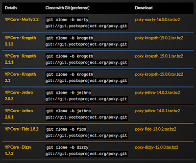

# YOCTO Project
----  

Yocto Project 의 전체 구조를 한마디로 요약해 표현하기에는 매우 어렵다. 아래 그림은 Yocto Project 를 구성하는 여러 요소를 하나의 그림으로 표현한 것인데, 그 중심에는 Poky (reference system) 와 OpenEmbedded Core (build system)가 있다.

Yocto 의 주요 구성 요소를 간략히 소개해 보면 다음과 같다.


<Yocto Project 의 주요 구성 요소>

- OpenEmbedded-Core(중요1) : OpenEmbedded project 와 공유되는 core meta data, base layer 묶음.
 참고) OpenEmbedded project 는 http://openembedded.org 를 home page 로 하는 별도의 build system 으로, 이것만 가지고 linux 배포판을 만들 수 있을 정도로 매우 강력함. yocto 의 핵심.

- Poky(중요2) : Yocto project 의 reference system 으로, 다양한 tool 과 meta data 로 이루어짐. 여기에 자신만의 target board 에 대한 내용을 추가해 줌으로써 최종적으로 원하는 linux system 을 만들어 낼 수 있겠음.

- BitBike(중요3) : python 과 shell script 로 만들어진 task scheduler 로써, build 하고자 하는 source 를download 하고, build 한 후, 최종 install 하기 까지의 전 과정을 담당함. Make 와 유사하다고 볼 수도 있겠으나, 실제로는 규모면에서 차이가 있음. 

- Meta data : 아래 세가지를 일컬어 meta data 라고 함.
 Recipes (.bb) : the logical units of software / images to build.
 Classes (.bbclass) : abstraction to common code(task).
 Configuration files (.conf) : global definitions of variables.

- Recipe : buildroot의 package 에 해당하는 내용. source download -> build -> install 관련 내용을 기술하고 있음. BitBake 가 이 내용을 보고, 실제로 취하게 됨. 

# 1. Yocto Project 의 대략적인 작업 순서.

0) Poky reference system 을 준비.(download & 환경 설정) 한다.
1) 자신의 target board 에 맞는 BSP layer 를 하나 만든다. 혹은 기존에 존재하는 내용이 있다면 이를 이용(혹은 개선)한다.
2) (필요하다고 판단이 될 경우) 기존에 다른 사람들이 만들어 둔 layer (meta-XXXX) 를 찾아 download 한다.
3) 자신의 target board 에 맞는 gerneral layer 를 만든다.(필요한 경우.)
 -> conf file & meta data 를 적절히 준비(수정)해둔다.
 -> 추가로 필요한 recipe 를 만든다.
4) (이후 작업은 bitbake 가 진행함) Receipe 를만들어 둔다.
5) Source code 에 대한 patch 가 존재할 경우 관련 patch 를 진행한다.
6) configure & compile 을 진행한다.
7) install 을 한다.
8) build 가 정상적으로 진행될 경우, package 파일(RPM, ipk 등)을 생성한다.
9) booting 에 필요한 이미지(kernel, rootfs 등)를 생성한다.


<Yocto Project 의 동작 방식 1.>


<Yocto Project 의 동작 방식 2.>


# 2. Poky 소개.

Yocto project 의 reference system 인 poky 의 source 를 내려받아 build 해봄으로써, yocto project 가 어떤 형태로 이루어져 있는지 가늠해 보자.



<YP Core releases>

Poky build 절차 소개

```
$ mkdir yocto ; cd yocto

$ git clone -b morty git://git.yoctoproject.org/poky.git
-> morty 는 2.2 최신 version(branch) 임.

$ cd poky ;  ls -l
total 72
drwxrwxr-x  6 lchy0113 lchy0113  4096 Oct  8 19:21 bitbake
drwxrwxr-x  3 lchy0113 lchy0113  4096 Oct  8 19:22 build
drwxrwxr-x 14 lchy0113 lchy0113  4096 Oct  8 19:21 documentation
-rw-rw-r--  1 lchy0113 lchy0113   515 Oct  8 19:21 LICENSE
drwxrwxr-x 20 lchy0113 lchy0113  4096 Oct  8 19:21 meta
drwxrwxr-x  5 lchy0113 lchy0113  4096 Oct  8 19:21 meta-poky
drwxrwxr-x  7 lchy0113 lchy0113  4096 Oct  8 19:21 meta-selftest
drwxrwxr-x  7 lchy0113 lchy0113  4096 Oct  8 19:21 meta-skeleton
drwxrwxr-x  3 lchy0113 lchy0113  4096 Oct  8 19:21 meta-yocto
drwxrwxr-x  8 lchy0113 lchy0113  4096 Oct  8 19:21 meta-yocto-bsp
-rwxrwxr-x  1 lchy0113 lchy0113  2121 Oct  8 19:21 oe-init-build-env
-rwxrwxr-x  1 lchy0113 lchy0113  2559 Oct  8 19:21 oe-init-build-env-memres
-rw-rw-r--  1 lchy0113 lchy0113  2467 Oct  8 19:21 README
-rw-rw-r--  1 lchy0113 lchy0113 12832 Oct  8 19:21 README.hardware
drwxrwxr-x  8 lchy0113 lchy0113  4096 Oct  8 19:21 scripts

$ source oe-init-build-env
-> 기본 환경 설정을 진행한다.
-> build 라는 directory 를 생성하고, build 를 current directory 로 만든다.
-> oe-init-build-env 다음에 아무 값도 지정하지 않을 경우, ARM QEMU emulator 가 만들어 진다. 
You had no conf/local.conf file. This configuration file has therefore been
created for you with some default values. You may wish to edit it to, for
example, select a different MACHINE (target hardware). See conf/local.conf
for more information as common configuration options are commented.

You had no conf/bblayers.conf file. This configuration file has therefore been
created for you with some default values. To add additional metadata layers
into your configuration please add entries to conf/bblayers.conf.

The Yocto Project has extensive documentation about OE including a reference
manual which can be found at:
    http://yoctoproject.org/documentation

	For more information about OpenEmbedded see their website:
	    http://www.openembedded.org/


### Shell environment set up for builds. ###

You can now run 'bitbake <target>'

Common targets are:
    core-image-minimal
    core-image-sato
    meta-toolchain
    meta-ide-support

You can also run generated qemu images with a command like 'runqemu qemux86'

위의 명령 실행 후, build/conf 디렉토리 아래에 몇가지 파일이 자동으로 생성되게 되는데, 각각의 파일이 의미하는 바를 자세히 따져볼 필요가 있다.(실제로 추후, 자신의 board 에 맞도록 해당 파일의 내용을 수정해 주어야 함.)

$ ls -al 
total 12
drwxrwxr-x  3 lchy0113 lchy0113 4096 Oct  8 19:47 .
drwxrwxr-x 13 lchy0113 lchy0113 4096 Oct  8 19:47 ..
drwxrwxr-x  2 lchy0113 lchy0113 4096 Oct  8 19:47 conf

$ cd conf 
$ ls
bblayers.conf  local.conf  templateconf.cfg
```

----
( 작성중 )
http://slowbootkernelhacks.blogspot.com/2016/12/yocto-project.html
