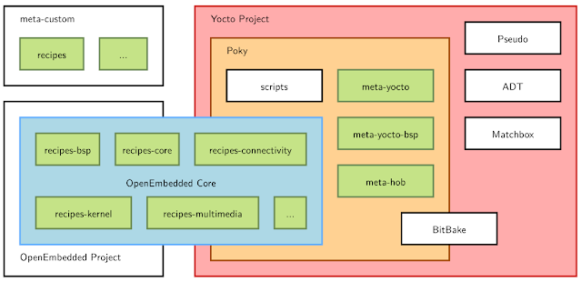
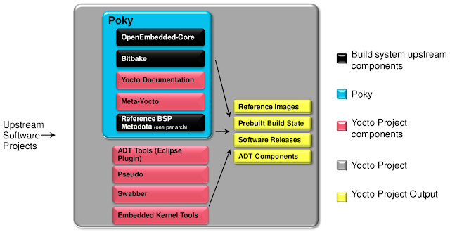

# YOCTO Project
----  

Yocto Project 의 전체 구조를 한마디로 요약해 표현하기에는 매우 어렵다. 아래 그림은 Yocto Project 를 구성하는 여러 요소를 하나의 그림으로 표현한 것인데, 그 중심에는 Poky (reference system) 와 OpenEmbedded Core (build system)가 있다.

Yocto 의 주요 구성 요소를 간략히 소개해 보면 다음과 같다.




- OpenEmbedded-Core(중요1) : OpenEmbedded project 와 공유되는 core meta data, base layer 묶음.
 참고) OpenEmbedded project 는 http://openembedded.org 를 home page 로 하는 별도의 build system 으로, 이것만 가지고 linux 배포판을 만들 수 있을 정도로 매우 강력함. yocto 의 핵심.

- Poky(중요2) : Yocto project 의 reference system 으로, 다양한 tool 과 meta data 로 이루어짐. 여기에 자신만의 target board 에 대한 내용을 추가해 줌으로써 최종적으로 원하는 linux system 을 만들어 낼 수 있겠음.

- BitBike(중요3) : python 과 shell script 로 만들어진 task scheduler 로써, build 하고자 하는 source 를download 하고, build 한 후, 최종 install 하기 까지의 전 과정을 담당함. Make 와 유사하다고 볼 수도 있겠으나, 실제로는 규모면에서 차이가 있음. 

- Meta data : 아래 세가지를 일컬어 meta data 라고 함.
 Recipes (.bb) : the logical units of software / images to build.
 Classes (.bbclass) : abstraction to common code(task).
 Configuration files (.conf) : global definitions of variables.

- Recipe : buildroot의 package 에 해당하는 내용. source download -> build -> install 관련 내용을 기술하고 있음. BitBake 가 이 내용을 보고, 실제로 취하게 됨. 

# 1. Yocto Project 의 대략적인 작업 순서.

0) Poky reference system 을 준비.(download & 환경 설정) 한다.
1) 자신의 target board 에 맞는 BSP layer 를 하나 만든다. 혹은 기존에 존재하는 내용이 있다면 이를 이용(혹은 개선)한다.
2) (필요하다고 판단이 될 경우) 기존에 다른 사람들이 만들어 둔 layer (meta-XXXX) 를 찾아 download 한다.
3) 자신의 target board 에 맞는 gerneral layer 를 만든다.(필요한 경우.)
 -> conf file & meta data 를 적절히 준비(수정)해둔다.
 -> 추가로 필요한 recipe 를 만든다.
4) (이후 작업은 bitbake 가 진행함) Receipe 를만들어 둔다.
5) Source code 에 대한 patch 가 존재할 경우 관련 patch 를 진행한다.
6) configure & compile 을 진행한다.
7) install 을 한다.
8) build 가 정상적으로 진행될 경우, package 파일(RPM, ipk 등)을 생성한다.
9) booting 에 필요한 이미지(kernel, rootfs 등)를 생성한다.




# 2. Poky 소개.

Yocto project 의 reference system 인 poky 의 source 를 내려받아 build 해봄으로써, yocto project 가 어떤 형태로 이루어져 있는지 가늠해 보자.


Poky build 절차 소개

```
$ mkdir yocto ; cd yocto

$ git clone -b morty git://git.yoctoproject.org/poky.git
-> morty 는 2.2 최신 version(branch) 임.

$ cd poky ;  ls -l
========================================

total 72
drwxrwxr-x  6 lchy0113 lchy0113  4096 Oct  8 19:21 bitbake
drwxrwxr-x  3 lchy0113 lchy0113  4096 Oct  8 19:22 build
drwxrwxr-x 14 lchy0113 lchy0113  4096 Oct  8 19:21 documentation
-rw-rw-r--  1 lchy0113 lchy0113   515 Oct  8 19:21 LICENSE
drwxrwxr-x 20 lchy0113 lchy0113  4096 Oct  8 19:21 meta
drwxrwxr-x  5 lchy0113 lchy0113  4096 Oct  8 19:21 meta-poky
drwxrwxr-x  7 lchy0113 lchy0113  4096 Oct  8 19:21 meta-selftest
drwxrwxr-x  7 lchy0113 lchy0113  4096 Oct  8 19:21 meta-skeleton
drwxrwxr-x  3 lchy0113 lchy0113  4096 Oct  8 19:21 meta-yocto
drwxrwxr-x  8 lchy0113 lchy0113  4096 Oct  8 19:21 meta-yocto-bsp
-rwxrwxr-x  1 lchy0113 lchy0113  2121 Oct  8 19:21 oe-init-build-env
-rwxrwxr-x  1 lchy0113 lchy0113  2559 Oct  8 19:21 oe-init-build-env-memres
-rw-rw-r--  1 lchy0113 lchy0113  2467 Oct  8 19:21 README
-rw-rw-r--  1 lchy0113 lchy0113 12832 Oct  8 19:21 README.hardware
drwxrwxr-x  8 lchy0113 lchy0113  4096 Oct  8 19:21 scripts

$ source oe-init-build-env
-> 기본 환경 설정을 진행한다.
-> build 라는 directory 를 생성하고, build 를 current directory 로 만든다.
-> oe-init-build-env 다음에 아무 값도 지정하지 않을 경우, ARM QEMU emulator 가 만들어 진다. 
========================================

You had no conf/local.conf file. This configuration file has therefore been
created for you with some default values. You may wish to edit it to, for
example, select a different MACHINE (target hardware). See conf/local.conf
for more information as common configuration options are commented.

You had no conf/bblayers.conf file. This configuration file has therefore been
created for you with some default values. To add additional metadata layers
into your configuration please add entries to conf/bblayers.conf.

The Yocto Project has extensive documentation about OE including a reference
manual which can be found at:
    http://yoctoproject.org/documentation

	For more information about OpenEmbedded see their website:
	    http://www.openembedded.org/


### Shell environment set up for builds. ###

You can now run 'bitbake <target>'

Common targets are:
    core-image-minimal
    core-image-sato
    meta-toolchain
    meta-ide-support

You can also run generated qemu images with a command like 'runqemu qemux86'

========================================
위의 명령 실행 후, build/conf 디렉토리 아래에 몇가지 파일이 자동으로 생성되게 되는데, 각각의 파일이 의미하는 바를 자세히 따져볼 필요가 있다.(실제로 추후, 자신의 board 에 맞도록 해당 파일의 내용을 수정해 주어야 함.)

$ ls -al 
total 12
drwxrwxr-x  3 lchy0113 lchy0113 4096 Oct  8 19:47 .
drwxrwxr-x 13 lchy0113 lchy0113 4096 Oct  8 19:47 ..
drwxrwxr-x  2 lchy0113 lchy0113 4096 Oct  8 19:47 conf

$ cd conf 
$ ls
bblayers.conf  local.conf  templateconf.cfg
-> bblayers.conf : layer 관련 디렉토리 목록을 정의하고 있음. 자신의 device 에 맞게 수정해야 함.
-> local.conf : build 하려는 device 관련 spec 을 정의하고, build 환경을 담고 있음. (이 내용을 자신의 device 에 맞게 수정해야 함.)
-> templateconf.cfg : 여러 conf file 이 위치한 디렉토리를 정의하고있음. default 는 meta-yocto/conf 임.
========================================

$ bitbake core-image-minimal
Parsing recipes:   1% |#                                                                           | ETA:  0:02:47
...

-> bitbake task scheduler 를 이용하여 실제 build 를 진행하여, 최종적으로 bootloader, kernel, root file system 등의 이미지 및 패키지(rpm, deb, or ipk)를 만들어 낸다.
-> bitbake 다음에 입력 가능한 root image 생성 방식으로는 다음과 같은 것들이 있다.
<build 가능한 image 형태>
core-image-minimal : small image 생성(recipes-core/images/core-image-minimal.bb).
core-image-minimal-initramfs : initramfs 용 이미지 생성.
core-image-x11 : X11 기능이 포함된 이미지 생성.
core-image-sato : GNOME이 포함된 이미지 생성.
...

```
<결과물>
build/tmp/deplay/images/*
```
$ ls -al tmp/deploy/images/
total 12
drwxrwxr-x 3 lchy0113 lchy0113 4096 Oct 11 09:49 .
drwxr-xr-x 5 lchy0113 lchy0113 4096 Oct 11 09:49 ..
drwxr-xr-x 2 lchy0113 lchy0113 4096 Oct 11 09:54 qemux86
lchy0113@KdVM:~/Private/yocto_develop/yocto/poky/build$ ls -al tmp/deploy/images/qemux86/
total 20352
drwxr-xr-x 2 lchy0113 lchy0113    4096 Oct 11 09:54 .
drwxrwxr-x 3 lchy0113 lchy0113    4096 Oct 11 09:49 ..
lrwxrwxrwx 2 lchy0113 lchy0113      72 Oct 11 09:49 bzImage -> bzImage--4.8.26+git0+1c60e003c7_27efc3ba68-r0-qemux86-20191011000817.bin
-rw-r--r-- 2 lchy0113 lchy0113 7047488 Oct 11 09:49 bzImage--4.8.26+git0+1c60e003c7_27efc3ba68-r0-qemux86-20191011000817.bin
lrwxrwxrwx 2 lchy0113 lchy0113      72 Oct 11 09:49 bzImage-qemux86.bin -> bzImage--4.8.26+git0+1c60e003c7_27efc3ba68-r0-qemux86-20191011000817.bin
-rw-r--r-- 1 lchy0113 lchy0113    1365 Oct 11 09:54 core-image-minimal-qemux86-20191011000817.qemuboot.conf
-rw-r--r-- 2 lchy0113 lchy0113 9723904 Oct 11 11:52 core-image-minimal-qemux86-20191011000817.rootfs.ext4
-rw-r--r-- 2 lchy0113 lchy0113     788 Oct 11 09:54 core-image-minimal-qemux86-20191011000817.rootfs.manifest
-rw-r--r-- 2 lchy0113 lchy0113 2620633 Oct 11 09:54 core-image-minimal-qemux86-20191011000817.rootfs.tar.bz2
lrwxrwxrwx 2 lchy0113 lchy0113      53 Oct 11 09:54 core-image-minimal-qemux86.ext4 -> core-image-minimal-qemux86-20191011000817.rootfs.ext4
lrwxrwxrwx 2 lchy0113 lchy0113      57 Oct 11 09:54 core-image-minimal-qemux86.manifest -> core-image-minimal-qemux86-20191011000817.rootfs.manifest
lrwxrwxrwx 1 lchy0113 lchy0113      55 Oct 11 09:54 core-image-minimal-qemux86.qemuboot.conf -> core-image-minimal-qemux86-20191011000817.qemuboot.conf
lrwxrwxrwx 2 lchy0113 lchy0113      56 Oct 11 09:54 core-image-minimal-qemux86.tar.bz2 -> core-image-minimal-qemux86-20191011000817.rootfs.tar.bz2
-rw-rw-r-- 2 lchy0113 lchy0113 4567379 Oct 11 09:49 modules--4.8.26+git0+1c60e003c7_27efc3ba68-r0-qemux86-20191011000817.tgz
lrwxrwxrwx 2 lchy0113 lchy0113      72 Oct 11 09:49 modules-qemux86.tgz -> modules--4.8.26+git0+1c60e003c7_27efc3ba68-r0-qemux86-20191011000817.tgz

```

여기까지,  Yocto project의 reference system인 poky를 내려 받아 전체 build를 진행하여, ARM QEMU emulator용 이미지를 생성하는 과정을 살펴 보았다.


ARM QEMU emulator 용 image를 실행하기 위해서는 "runqemu qemuarm" 명령을 실행하면 된다.


----
http://slowbootkernelhacks.blogspot.com/2016/12/yocto-project.html

# Yocto 내부 파일 분석
-----
 Yocto 프로젝트를 다운 받고 나면 c 코드는 하나도 없고 대부분 .bb, .inc로 이뤄진 스크립트 파일들이 대부분인 것을 확인 할 수 있다. 소스코드 하나 없이 위 파일들만 있으면 설정한 보드에서 동작하는 이미지가 나온다는 것이 신기하기도 하다.


눈치를 챈 사람들도 있겠지만 이 .bb, .inc 파일들은 스크립트이다. 이미지를 만들 때 필요한 소스 코드들을,
* 어디서 읽어올 것인지(do_fetch)
* 어떤 설정을 줄 것인지(do_configure)
* 어떤 컴파일 명령을 줄 것인지(do_compile)
* 어디에 설치 할 것인지(do_install)

에 대한 정보들을 담고 있다. 잘 생각해보면 위의 작업들은 우리가 특정 파일들을 다운받고 빌드 할 때까지 이뤄지는 작업들과 굉장히 유사하다. 예를 들면 linux 4.2 버전을 받고 커널을 빌드 할 때 개발자의 과정들을 보면,
1. 원격 저장소로부터 소스들을 다운받는다.(git clone ...)
2. .config 파일을 만든다. (make config)
3. 컴파일 실행 (make ARCH=arm ...)
4. 어디에 설치할 것인지(do_install)

로 이루어져 있다. yocto 는 이러한 수작업들을 하나의 파일내에서 모두 정리 될 수 있도록 만들어 주는 편리한 시스템이다.
직접 코드를 한번 보자. 
poky/meta/recipes-core/glibc/glibc_2.23.bb 스크립트 내용은 다음과 같다.
```
require glibc.inc

LIC_FILES_CHKSUM = "file://LICENSES;md5=e9a558e243b36d3209f380deb394b213 \
      file://COPYING;md5=b234ee4d69f5fce4486a80fdaf4a4263 \
      file://posix/rxspencer/COPYRIGHT;md5=dc5485bb394a13b2332ec1c785f5d83a \
      file://COPYING.LIB;md5=4fbd65380cdd255951079008b364516c"

DEPENDS += "gperf-native"

SRCREV ?= "ea23815a795f72035262953dad5beb03e09c17dd"

SRCBRANCH ?= "release/${PV}/master"

GLIBC_GIT_URI ?= "git://sourceware.org/git/glibc.git"
UPSTREAM_CHECK_GITTAGREGEX = "(?P<pver>\d+\.\d+(\.\d+)*)"

SRC_URI = "${GLIBC_GIT_URI};branch=${SRCBRANCH};name=glibc \
           file://0005-fsl-e500-e5500-e6500-603e-fsqrt-implementation.patch \
           file://0006-readlib-Add-OECORE_KNOWN_INTERPRETER_NAMES-to-known-.patch \
           file://0007-ppc-sqrt-Fix-undefined-reference-to-__sqrt_finite.patch \
           file://0008-__ieee754_sqrt-f-are-now-inline-functions-and-call-o.patch \
           file://0009-Quote-from-bug-1443-which-explains-what-the-patch-do.patch \
           file://0010-eglibc-run-libm-err-tab.pl-with-specific-dirs-in-S.patch \
           file://0011-__ieee754_sqrt-f-are-now-inline-functions-and-call-o.patch \
           file://0012-Make-ld-version-output-matching-grok-gold-s-output.patch \
           file://0013-sysdeps-gnu-configure.ac-handle-correctly-libc_cv_ro.patch \
           file://0014-Add-unused-attribute.patch \
           file://0015-yes-within-the-path-sets-wrong-config-variables.patch \
           file://0016-timezone-re-written-tzselect-as-posix-sh.patch \
           file://0017-Remove-bash-dependency-for-nscd-init-script.patch \
           file://0018-eglibc-Cross-building-and-testing-instructions.patch \
           file://0019-eglibc-Help-bootstrap-cross-toolchain.patch \
           file://0020-eglibc-cherry-picked-from.patch \
           file://0021-eglibc-Clear-cache-lines-on-ppc8xx.patch \
           file://0022-eglibc-Resolve-__fpscr_values-on-SH4.patch \
           file://0023-eglibc-Install-PIC-archives.patch \
           file://0024-eglibc-Forward-port-cross-locale-generation-support.patch \
           file://0025-Define-DUMMY_LOCALE_T-if-not-defined.patch \
           file://0026-build_local_scope.patch \
           file://0028-Bug-20116-Fix-use-after-free-in-pthread_create.patch \
           file://CVE-2016-6323.patch \
           file://0001-Add-atomic_exchange_relaxed.patch \
           file://0002-Add-atomic-operations-required-by-the-new-condition-.patch \
           file://0003-Add-pretty-printers-for-the-NPTL-lock-types.patch \
           file://0004-New-condvar-implementation-that-provides-stronger-or.patch \
           file://0005-Remove-__ASSUME_REQUEUE_PI.patch \
           file://0006-Fix-atomic_fetch_xor_release.patch \
           file://0001-CVE-2015-5180-resolv-Fix-crash-with-internal-QTYPE-B.patch \
           file://0001-CVE-2017-1000366-Ignore-LD_LIBRARY_PATH-for-AT_SECUR.patch \
           file://0002-ld.so-Reject-overly-long-LD_PRELOAD-path-elements.patch \
           file://0003-ld.so-Reject-overly-long-LD_AUDIT-path-elements.patch \
           file://0004-i686-Add-missing-IS_IN-libc-guards-to-vectorized-str.patch \
"

SRC_URI += "\
           file://etc/ld.so.conf \
           file://generate-supported.mk \
           file://0001-locale-fix-hard-coded-reference-to-gcc-E.patch \
           file://CVE-2017-8804.patch \
           file://CVE-2017-15670.patch \
           "

SRC_URI_append_class-nativesdk = "\
           file://0001-nativesdk-glibc-Look-for-host-system-ld.so.cache-as-.patch \
           file://0002-nativesdk-glibc-Fix-buffer-overrun-with-a-relocated-.patch \
           file://0003-nativesdk-glibc-Raise-the-size-of-arrays-containing-.patch \
           file://0004-nativesdk-glibc-Allow-64-bit-atomics-for-x86.patch \
           file://relocate-locales.patch \
"

S = "${WORKDIR}/git"
B = "${WORKDIR}/build-${TARGET_SYS}"

PACKAGES_DYNAMIC = ""

# the -isystem in bitbake.conf screws up glibc do_stage
BUILD_CPPFLAGS = "-I${STAGING_INCDIR_NATIVE}"
TARGET_CPPFLAGS = "-I${STAGING_DIR_TARGET}${includedir}"

GLIBC_BROKEN_LOCALES = ""
#
# We will skip parsing glibc when target system C library selection is not glibc
# this helps in easing out parsing for non-glibc system libraries
#
COMPATIBLE_HOST_libc-musl_class-target = "null"
COMPATIBLE_HOST_libc-uclibc_class-target = "null"

EXTRA_OECONF = "--enable-kernel=${OLDEST_KERNEL} \
                --without-cvs --disable-profile \
                --disable-debug --without-gd \
                --enable-clocale=gnu \
                --enable-add-ons \
                --with-headers=${STAGING_INCDIR} \
                --without-selinux \
                --enable-obsolete-rpc \
                ${GLIBC_EXTRA_OECONF}"

EXTRA_OECONF += "${@get_libc_fpu_setting(bb, d)}"
EXTRA_OECONF += "${@bb.utils.contains('DISTRO_FEATURES', 'libc-inet-anl', '--enable-nscd', '--disable-nscd', d)}"


do_patch_append() {
    bb.build.exec_func('do_fix_readlib_c', d)
}

do_fix_readlib_c () {
        sed -i -e 's#OECORE_KNOWN_INTERPRETER_NAMES#${EGLIBC_KNOWN_INTERPRETER_NAMES}#' ${S}/elf/readlib.c
}

do_configure () {
# override this function to avoid the autoconf/automake/aclocal/autoheader
# calls for now
# don't pass CPPFLAGS into configure, since it upsets the kernel-headers
# version check and doesn't really help with anything
        (cd ${S} && gnu-configize) || die "failure in running gnu-configize"
        find ${S} -name "configure" | xargs touch
        CPPFLAGS="" oe_runconf
}

rpcsvc = "bootparam_prot.x nlm_prot.x rstat.x \
          yppasswd.x klm_prot.x rex.x sm_inter.x mount.x \
          rusers.x spray.x nfs_prot.x rquota.x key_prot.x"

do_compile () {
        # -Wl,-rpath-link <staging>/lib in LDFLAGS can cause breakage if another glibc is in staging
        unset LDFLAGS
        base_do_compile
        (
                cd ${S}/sunrpc/rpcsvc
                for r in ${rpcsvc}; do
                        h=`echo $r|sed -e's,\.x$,.h,'`
                        rm -f $h
                        ${B}/sunrpc/cross-rpcgen -h $r -o $h || bbwarn "${PN}: unable to generate header for $r"
                done
        )
        echo "Adjust ldd script"
        if [ -n "${RTLDLIST}" ]
        then
                prevrtld=`cat ${B}/elf/ldd | grep "^RTLDLIST=" | sed 's#^RTLDLIST="\?\([^"]*\)"\?$#\1#'`
                if [ "${prevrtld}" != "${RTLDLIST}" ]
                then
                        sed -i ${B}/elf/ldd -e "s#^RTLDLIST=.*\$#RTLDLIST=\"${prevrtld} ${RTLDLIST}\"#"
                fi
        fi

}

require glibc-package.inc

BBCLASSEXTEND = "nativesdk"
```

스크립트 내용은 많은데 내용을 몇가지만 간추려서 설명을 하고자 한다.
* SRC_URI : 저장소를 읽어오는 위치와 적용할 패치 파일들이 담겨있다. 가장 상위에는 텍스트, ${GLIBC_GIT_URI}는 읽어올 주소를 의미하고, branch 는 어떤 브랜치로 checkout 할 것인지이다. 그 아래 있는 패치들은 소스코드를 받은 후, 적용할 패치파일들이다. Yocto 에서 빌드 할 때 패치파일들을 자동으로 적용해 준다.
* do_configure() : 빌드할 config 파일들을 만들어 주는 작업이다. 여기에 새로운 내용을 넣어서 config 파일을 만들 수 있다.
* do_compile() : compile 명령을 내리는 작업이다. compile 시에 넣고 싶은 명령을 넣을 수 있따.
* do_install() : 위 코드에는 빠져있지만 컴파일이 완료 된 후, 빌드 결과물들을 특정 이미지에 놓는 명령들이 포함되어 있다.

위의 작업들은 한 파일내에 모두 존재하는 것이 아니고 여러 개의 파일들이 얽혀서 이뤄진다.
requir * 은 다른 파일들을 포함하는 작업(C언어의 include 와 유사) 인데 다른 파일의 스크립트 내용도 포함해서 작업이 이뤄진다.
한 파일 내에 모든 작업이 없다면 다른 파일에 있을 가능성이 높으니 참고하자.

가끔 %.bbapend 라는 파일이 있는데 이 파일은 말 그대로 bb 파일에 덧붙이는 용도이다. 주로 메인 보드가 아닌 다른 보드에서 컴파일 옵션이나 패치파일을 추가 해줘야 하는 경우에 사용한다. 

위 설명 yocto 파일들을 완벽히 이해할 수 없지만, 어떻게 수정하면 되겠구나 감 정도는 잡을 수 있게 된다. 
